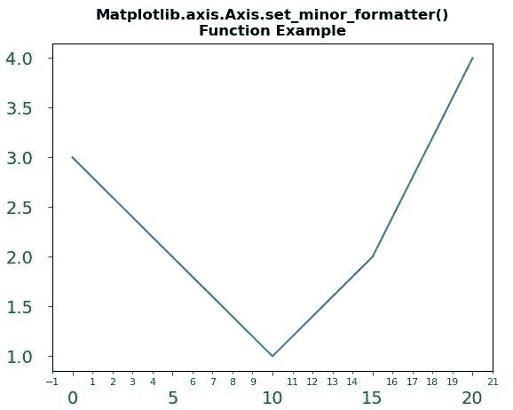
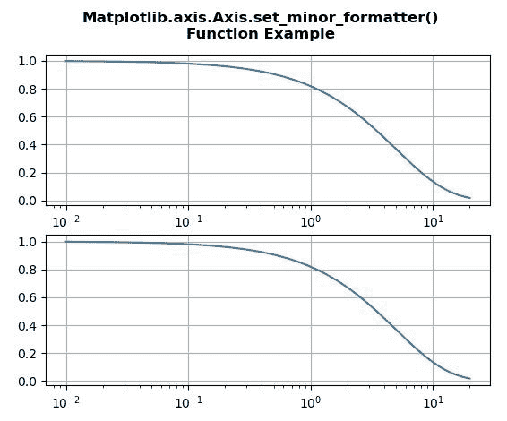

# Python 中的 matplotlib . axis . axis . set _ minor _ formatter()函数

> 原文:[https://www . geesforgeks . org/matplotlib-axis-axis-set _ minor _ formatter-python 中的函数/](https://www.geeksforgeeks.org/matplotlib-axis-axis-set_minor_formatter-function-in-python/)

[**Matplotlib**](https://www.geeksforgeeks.org/python-introduction-matplotlib/) 是 Python 中的一个库，是 NumPy 库的数值-数学扩展。这是一个神奇的 Python 可视化库，用于 2D 数组图，并用于处理更广泛的 SciPy 堆栈。

## matplotlib . axis . axis . set _ minor _ formatter()函数

matplotlib 库的 Axis 模块中的 **Axis.set_minor_formatter()函数**用于设置 minor ticker 的格式化程序。

> **语法:**axis . set _ minor _ formatter(self，formatter)
> 
> **参数:**该方法接受以下参数。
> 
> *   **格式化程序:**该参数是*格式化程序*。
> 
> **返回值:**此方法不返回值。

以下示例说明 matplotlib . axis . axis . set _ minor _ formatter()函数在 matplotlib.axis:
**示例 1:**

## 蟒蛇 3

```py
# Implementation of matplotlib function 
from matplotlib.axis import Axis
import matplotlib.pyplot as plt 
from matplotlib.ticker import MultipleLocator, ScalarFormatter 

fig, ax = plt.subplots() 
ax.plot([0, 5, 10, 15, 20], [3, 2, 1, 2, 4]) 

Axis.set_minor_locator(ax.xaxis, MultipleLocator(1)) 
Axis.set_minor_formatter(ax.xaxis, ScalarFormatter()) 

ax.tick_params(axis ='both', which ='major',  
               labelsize = 14, pad = 12,  
               colors ='g') 

ax.tick_params(axis ='both', which ='minor', 
               labelsize = 8, colors ='b') 

plt.title("Matplotlib.axis.Axis.set_minor_formatter()\n\
Function Example", fontsize = 12, fontweight ='bold') 

plt.show()
```

**输出:**



**例 2:**

## 蟒蛇 3

```py
# Implementation of matplotlib function 
from matplotlib.axis import Axis
import matplotlib.pyplot as plt 
from matplotlib.ticker import LogFormatter 
import numpy as np 

fig, axes = plt.subplots(2) 

dt = 0.01
t = np.arange(dt, 20.0, dt) 

# first plot doesn't use a formatter 
axes[0].semilogx(t, np.exp(-t / 5.0))  
axes[0].grid() 

xlims = [[0, 25], [0.2, 8], [0.6, 0.9]] 

for ax, xlim in zip(axes[1:], xlims): 

    ax.semilogx(t, np.exp(-t / 5.0)) 
    formatter = LogFormatter(labelOnlyBase = False,  
                             minor_thresholds = (2, 0.4)) 

    Axis.set_minor_formatter(ax.xaxis, formatter)  
    ax.grid() 

fig.suptitle("Matplotlib.axis.Axis.set_minor_formatter()\n\
Function Example", fontsize = 12, fontweight ='bold') 

plt.show()
```

**输出:**

