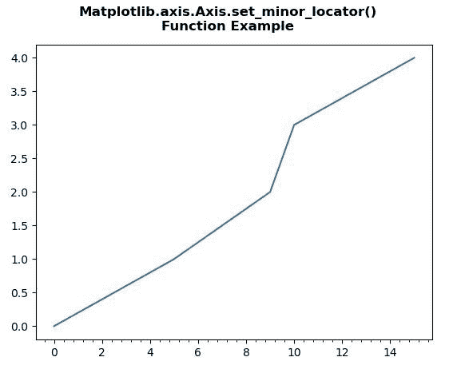
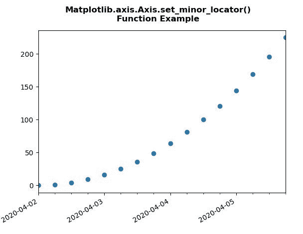

# Python 中的 matplotlib . axis . axis . set _ minor _ locator()函数

> 原文:[https://www . geesforgeks . org/matplotlib-axis-axis-set _ minor _ locator-python 中的函数/](https://www.geeksforgeeks.org/matplotlib-axis-axis-set_minor_locator-function-in-python/)

[**Matplotlib**](https://www.geeksforgeeks.org/python-introduction-matplotlib/) 是 Python 中的一个库，是 NumPy 库的数值-数学扩展。这是一个神奇的 Python 可视化库，用于 2D 数组图，并用于处理更广泛的 SciPy 堆栈。

## matplotlib . axis . axis . set _ minor _ locator()函数

matplotlib 库的 Axis 模块中的 **Axis.set_minor_locator()函数**用于设置 minor ticker 的定位器。

> **语法:** Axis.set_minor_locator(自身，定位器)
> 
> **参数:**该方法接受以下参数。
> 
> *   **格式化程序:**该参数是*定位器*。
> 
> **返回值:**此方法不返回值。

以下示例说明 matplotlib . axis . axis . set _ minor _ locator()函数在 matplotlib.axis:
**示例 1:**

## 蟒蛇 3

```py
# Implementation of matplotlib function 
from matplotlib.axis import Axis
import matplotlib.pyplot as plt 
import matplotlib.ticker as ticker 

x = [0, 5, 9, 10, 15] 
y = [0, 1, 2, 3, 4] 

tick_spacing = 0.4

fig, ax = plt.subplots(1, 1) 
ax.plot(x, y) 
ax.xaxis.set_minor_locator(ticker.MultipleLocator(tick_spacing))

fig.suptitle("Matplotlib.axis.Axis.set_minor_locator()\n\
Function Example", fontsize = 12, fontweight ='bold') 

plt.show()
```

**输出:**



**例 2:**

## 蟒蛇 3

```py
# Implementation of matplotlib function 
from matplotlib.axis import Axis
import datetime 
import matplotlib.pyplot as plt 
from matplotlib.dates import DayLocator, HourLocator, DateFormatter, drange 
import numpy as np 

date1 = datetime.datetime(2020, 4, 2) 
date2 = datetime.datetime(2020, 4, 6) 
delta = datetime.timedelta(hours = 6) 
dates = drange(date1, date2, delta) 

y = np.arange(len(dates)) 

fig, ax = plt.subplots() 
ax.plot_date(dates, y ** 2) 

ax.set_xlim(dates[0], dates[-1]) 

ax.xaxis.set_major_locator(DayLocator()) 
Axis.set_minor_locator(ax.xaxis, HourLocator(range(0, 25, 6))) 
ax.xaxis.set_major_formatter(DateFormatter('%Y-%m-%d')) 

ax.fmt_xdata = DateFormatter('%Y-%m-%d %H:%M:%S') 
fig.autofmt_xdate()

fig.suptitle("Matplotlib.axis.Axis.set_minor_locator()\n\
Function Example", fontsize = 12, fontweight ='bold') 

plt.show()
```

**输出:**

