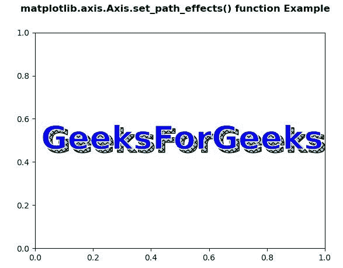
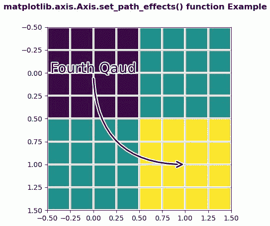

# Python 中的 matplotlib . axis . axis . set _ path _ effects()函数

> 原文:[https://www . geeksforgeeks . org/matplotlib-axis-axis-set _ path _ effects-python 中的函数/](https://www.geeksforgeeks.org/matplotlib-axis-axis-set_path_effects-function-in-python/)

[**Matplotlib**](https://www.geeksforgeeks.org/python-introduction-matplotlib/) 是 Python 中的一个库，是 NumPy 库的数值-数学扩展。这是一个神奇的 Python 可视化库，用于 2D 数组图，并用于处理更广泛的 SciPy 堆栈。

## matplotlib . axis . axis . set _ path _ effects()函数

matplotlib 库的 Axis 模块中的 **Axis.set_path_effects()函数**用于设置路径效果。

> **语法:** Axis.set_path_effects(自身，path_effects)
> 
> **参数:**该方法接受以下参数。
> 
> *   **path_effects :** 此参数为抽象路径效果。
> 
> **返回值:**此方法不返回值。

下面的例子说明了 matplotlib.axis . axis . set _ path _ effects()函数在 matplotlib . axis 中的作用:

**例 1:**

## 蟒蛇 3

```py
# Implementation of matplotlib function
from matplotlib.axis import Axis
import matplotlib.pyplot as plt  
import numpy as np  
import matplotlib.patheffects as path_effects  

fig, ax = plt.subplots()  
t = ax.text(0.02, 0.5,  
            'GeeksForGeeks',  
            fontsize = 40,   
            weight = 1000,   
            va ='center')  

Axis.set_path_effects(t, [path_effects.PathPatchEffect(offset =(4, -4),  
                                                 hatch ='xxxx',  
                                                 facecolor ='lightgreen'),  
                    path_effects.PathPatchEffect(edgecolor ='white',   
                                                 linewidth = 1.1,  
                                                 facecolor ='blue')]) 

fig.suptitle('matplotlib.axis.Axis.set_path_effects() \
function Example\n', fontweight ="bold")  

plt.show() 
```

**输出:**



**例 2:**

## 蟒蛇 3

```py
# Implementation of matplotlib function
from matplotlib.axis import Axis
import matplotlib.pyplot as plt  
import matplotlib.patheffects as PathEffects  
import numpy as np  

fig, ax1 = plt.subplots()  
ax1.imshow([[1, 2], [2, 3]])  

txt = ax1.annotate("Fourth Qaud",  
                   (1., 1.),  
                   (0., 0),  
                   arrowprops = dict(arrowstyle ="->",  
                                     connectionstyle ="angle3",  
                                     lw = 2),  
                   size = 20, ha ="center",  
                   path_effects =[PathEffects.withStroke(linewidth = 3,  
                                                         foreground ="w")])  

Axis.set_path_effects(txt.arrow_patch, [  
    PathEffects.Stroke(linewidth = 5,   
                       foreground ="w"),  
    PathEffects.Normal()])  

ax1.grid(True, linestyle ="-")  

pe = [PathEffects.withStroke(linewidth = 3,  
                             foreground ="w")]  

for l in ax1.get_xgridlines() + ax1.get_ygridlines():  
    Axis.set_path_effects(l, pe) 

fig.suptitle('matplotlib.axis.Axis.set_path_effects() \
function Example\n', fontweight ="bold")  

plt.show() 
```

**输出:**

