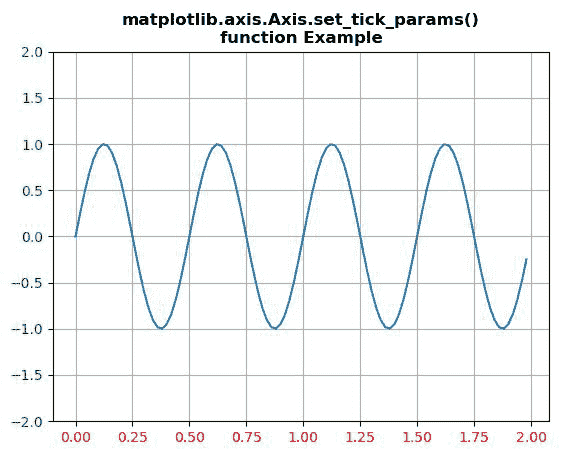

# Python 中的 matplotlib . axis . axis . set _ tick _ params()

> 原文:[https://www . geesforgeks . org/matplotlib-axis-axis-set _ tick _ params-in-python/](https://www.geeksforgeeks.org/matplotlib-axis-axis-set_tick_params-in-python/)

[**Matplotlib**](https://www.geeksforgeeks.org/python-introduction-matplotlib/) 是 Python 中的一个库，是 NumPy 库的数值-数学扩展。这是一个神奇的 Python 可视化库，用于 2D 数组图，并用于处理更广泛的 SciPy 堆栈。

## matplotlib . axis . axis . set _ tick _ params()函数

matplotlib 库的 Axis 模块中的 **Axis.set_tick_params()函数**用于设置刻度、刻度标签和网格线的外观参数。

> **语法:** Axis.set_tick_params(self，axis='major '，reset=False，*\*kw)
> 
> **参数:**该方法接受以下参数。
> 
> *   **轴:**此参数用于将参数应用到哪个轴。
> 
> **返回值:**此方法不返回值。

下面的例子说明了 matplotlib.axis . axis . set _ tick _ params()函数在 matplotlib . axis 中的作用:

**例 1:**

## 蟒蛇 3

```
# Implementation of matplotlib function 
import matplotlib.pyplot as plt
import numpy as np

t = np.arange(0.0, 2.0, 0.02)

fig, ax1 = plt.subplots()

ax1.plot(t, np.sin(4*np.pi * t))
ax1.grid(True)
ax1.set_ylim((-2, 2))

ax1.xaxis.set_tick_params(labelcolor='r')
ax1.yaxis.set_tick_params(labelcolor='g')

plt.title('matplotlib.axis.Axis.set_tick_params()\n\
function Example', fontweight ="bold") 

plt.show()
```

**输出:**



**例 2:**

## 蟒蛇 3

```
# Implementation of matplotlib function 
import matplotlib.pyplot as plt
from matplotlib.dates import (YEARLY, DateFormatter,
                              rrulewrapper, RRuleLocator, drange)
import numpy as np
import datetime

np.random.seed(19680801)

Val1 = rrulewrapper(YEARLY, byeaster=1, interval=5)
Val2 = RRuleLocator(Val1)

formatter = DateFormatter('%y/%m/%d')

date1 = datetime.date(2000, 1, 1)
date2 = datetime.date(2014, 4, 12)
delta = datetime.timedelta(days=10)

dates = drange(date1, date2, delta)
s = np.random.rand(len(dates))

fig, ax = plt.subplots()
plt.plot_date(dates, s,'go')

ax.xaxis.set_major_locator(Val2)
ax.xaxis.set_major_formatter(formatter)
ax.xaxis.set_tick_params(rotation=25,
                         labelsize=8 ,
                         labelcolor = "g")
ax.yaxis.set_tick_params(rotation=25,
                         labelsize=12 ,
                         labelcolor = "r")

plt.title('matplotlib.axis.Axis.set_tick_params()\n\
function Example', fontweight ="bold") 

plt.show()
```

**输出:**

