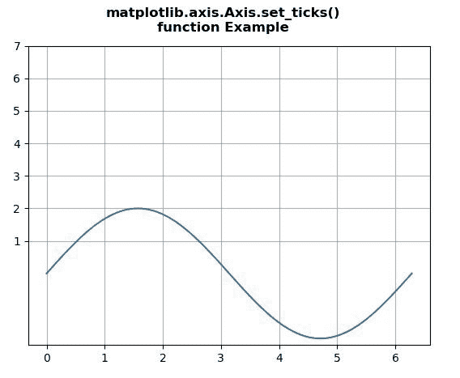
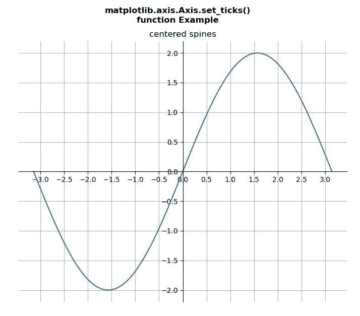

# Python 中的 Matplotlib.axis.Axis.set_ticks()函数

> 原文:[https://www . geesforgeks . org/matplotlib-axis-axis-set _ ticks-python 中的函数/](https://www.geeksforgeeks.org/matplotlib-axis-axis-set_ticks-function-in-python/)

[**Matplotlib**](https://www.geeksforgeeks.org/python-introduction-matplotlib/) 是 Python 中的一个库，是 NumPy 库的数值-数学扩展。这是一个神奇的 Python 可视化库，用于 2D 数组图，并用于处理更广泛的 SciPy 堆栈。

## Matplotlib.axis.Axis.set_ticks()函数

matplotlib 库的 Axis 模块中的 **Axis.set_ticks()函数**用于设置序列刻度中刻度线的位置。

> **语法:** Axis.set_ticks(self，ticks，*，minor=False)
> 
> **参数:**该方法接受以下参数。
> 
> *   **刻度:**这个参数是浮动的顺序。
> *   **次要:**该参数包含布尔值。
> 
> **返回值:**此方法不返回值。

下面的例子说明了 matplotlib.axis.Axis.set_ticks()函数在 matplotlib.axis:
中的作用

**例 1:**

## 蟒蛇 3

```py
# Implementation of matplotlib function
from matplotlib.axis import Axis
import matplotlib.pyplot as plt
import numpy as np 

fig = plt.figure()

x = np.linspace(0,2*np.pi,100)
y = 2*np.sin(x)

ax = fig.add_subplot()
ax.plot(x,y)
ax.yaxis.set_ticks([1,2,3,4,5,6,7])  

ax.grid() 

fig.suptitle("""matplotlib.axis.Axis.set_ticks()
function Example\n""", fontweight ="bold")  

plt.show()
```

**输出:**



**例 2:**

## 蟒蛇 3

```py
# Implementation of matplotlib function
from matplotlib.axis import Axis
import matplotlib.pyplot as plt
import numpy as np 

fig = plt.figure()
x = np.linspace(-np.pi, np.pi, 100)
y = 2 * np.sin(x)

ax = fig.add_subplot()
ax.set_title('centered spines')
ax.plot(x, y)

ax.spines['left'].set_position('center')
ax.spines['right'].set_color('none')
ax.spines['bottom'].set_position('center')
ax.spines['top'].set_color('none')

ax.xaxis.set_ticks_position('bottom')
ax.yaxis.set_ticks_position('left')
ax.xaxis.set_ticks([-3, -2.5, -2, -1.5, -1,
                    -0.5, 0, 0.5, 1, 1.5,
                    2, 2.5, 3])

ax.grid() 

fig.suptitle("""matplotlib.axis.Axis.set_ticks()
function Example\n""", fontweight ="bold")  

plt.show()
```

**输出:**

