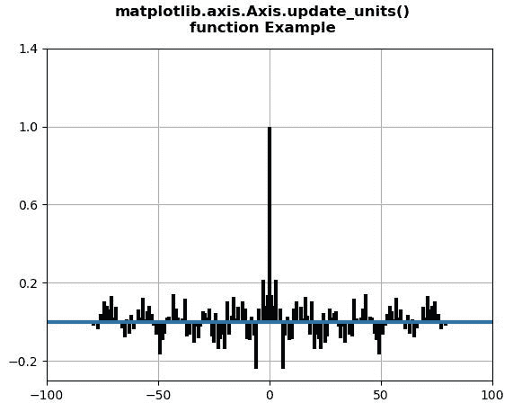
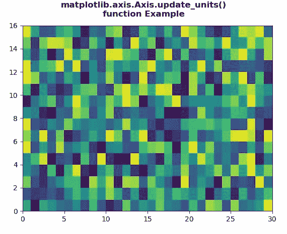

# Python 中的 matplotlib . axis . axis . update _ units()函数

> 原文:[https://www . geesforgeks . org/matplotlib-axis-axis-update _ units-python 中的函数/](https://www.geeksforgeeks.org/matplotlib-axis-axis-update_units-function-in-python/)

[**Matplotlib**](https://www.geeksforgeeks.org/python-introduction-matplotlib/) 是 Python 中的一个库，是 NumPy 库的数值-数学扩展。这是一个神奇的 Python 可视化库，用于 2D 数组图，并用于处理更广泛的 SciPy 堆栈。

## matplotlib . axis . axis . update _ units()函数

matplotlib 库的 Axis 模块中的 **Axis.update_units()函数**用于为 units converter 内省数据，必要时更新 axis.converter 实例。

> **语法:** Axis.update_units(自身，数据)
> 
> **参数:**该方法接受以下参数。
> 
> *   **数据:**该参数是需要更新的数据。
> 
> **返回值:**如果数据注册为单位转换，该方法返回真。

下面的例子说明了 matplotlib . axis . axis . update _ units()函数在 matplotlib.axis:
中的作用

**例 1:**

## 蟒蛇 3

```py
# Implementation of matplotlib function
from matplotlib.axis import Axis
import matplotlib.pyplot as plt  
import numpy as np  

np.random.seed(10**7)  
geeks = np.random.randn(100)  

fig, ax = plt.subplots()  
ax.acorr(geeks, usevlines = True,  
         normed = True,  
         maxlags = 80, lw = 3)  

ax.grid(True)  

prop = {'xticks': np.array([-100., -50., 
                            0., 50., 100.]),  
        'yticks': np.array([-0.2,  0.2,  
                            0.6, 1., 1.4]),  
        'ylabel': None, 'xlabel': None}  

ax.update(prop)

w = Axis.update_units(ax.xaxis,[1,2,3,4,5])
print(w)

fig.suptitle("""matplotlib.axis.Axis.update_units()
function Example\n""", fontweight ="bold")  

plt.show()
```

**输出:**



```py
False

```

**例 2**

## 蟒蛇 3

```py
# Implementation of matplotlib function
from matplotlib.axis import Axis
import numpy as np   
import matplotlib.pyplot as plt   

xx = np.random.rand(16, 30)   

fig, ax = plt.subplots()   

m = ax.pcolor(xx)   
m.set_zorder(-20)

w = Axis.update_units(ax.xaxis,[1,2,3,4,5])
print(w)

fig.suptitle("""matplotlib.axis.Axis.update_units()
function Example\n""", fontweight ="bold")  

plt.show()
```

**输出:**



```py
False

```