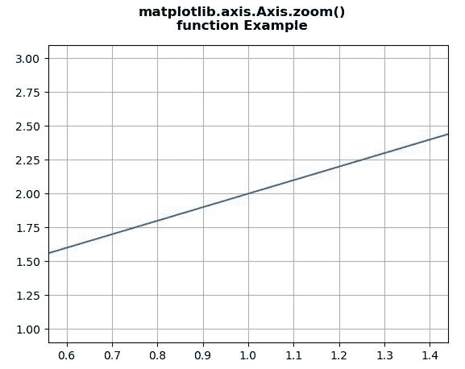
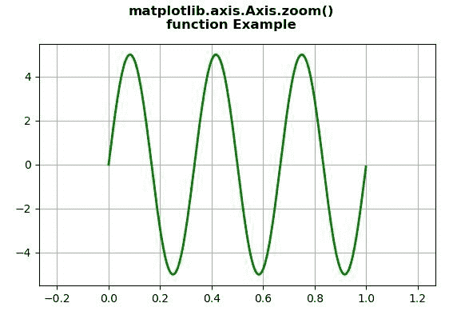

# Python 中的 Matplotlib.axis.Axis.zoom()函数

> 原文:[https://www . geesforgeks . org/matplotlib-axis-axis-zoom-function-in-python/](https://www.geeksforgeeks.org/matplotlib-axis-axis-zoom-function-in-python/)

[**Matplotlib**](https://www.geeksforgeeks.org/python-introduction-matplotlib/) 是 Python 中的一个库，是 NumPy 库的数值-数学扩展。这是一个神奇的 Python 可视化库，用于 2D 数组图，并用于处理更广泛的 SciPy 堆栈。

## Matplotlib.axis.Axis.zoom()

matplotlib 库的轴模块中的 **Axis.zoom()功能**用于在轴上放大或缩小。

> **语法:**轴.缩放(自身，方向)
> 
> **参数:**该方法接受以下参数。
> 
> *   **方向:**该参数为放大(方向> 0)或缩小(方向< = 0)的值。
> 
> **返回值:**此方法不返回值。

下面的例子说明了 matplotlib.axis.Axis.zoom()函数在 matplotlib.axis:

**例 1:**

## 蟒蛇 3

```py
# Implementation of matplotlib function
from matplotlib.axis import Axis
import matplotlib.pyplot as plt 
import numpy as np 

fig, ax = plt.subplots() 
ax.plot([1, 2, 3])  

ax.xaxis.zoom(3)

ax.grid() 

fig.suptitle("""matplotlib.axis.Axis.zoom()
function Example\n""", fontweight ="bold")  

plt.show()
```

**输出:**



**例 2:**

## 蟒蛇 3

```py
# Implementation of matplotlib function
from matplotlib.axis import Axis
import numpy as np 
import matplotlib.pyplot as plt 
from matplotlib.widgets import Slider, Button, RadioButtons 

fig, ax1 = plt.subplots() 
plt.subplots_adjust(bottom = 0.25) 
t = np.arange(0.0, 1.0, 0.001) 

a0 = 5
f0 = 3
delta_f = 5.0
s = a0 * np.sin(2 * np.pi * f0 * t) 

ax1.plot(t, s, lw = 2, color = 'green') 

ax1.xaxis.zoom(-2)

ax1.grid() 

fig.suptitle("""matplotlib.axis.Axis.zoom()
function Example\n""", fontweight ="bold")  

plt.show()
```

**输出:**

