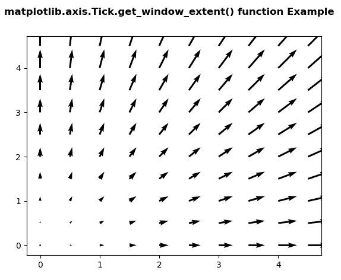
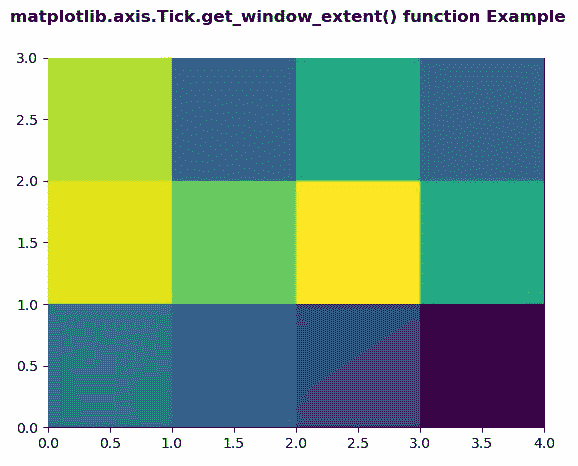

# Python 中的 matplotlib . axis . tick . get _ window _ extent()函数

> 原文:[https://www . geeksforgeeks . org/matplotlib-axis-tick-get _ window _ extend-python 中的函数/](https://www.geeksforgeeks.org/matplotlib-axis-tick-get_window_extent-function-in-python/)

[**Matplotlib**](https://www.geeksforgeeks.org/python-introduction-matplotlib/) 是 Python 中的一个库，是 NumPy 库的数值-数学扩展。这是一个神奇的 Python 可视化库，用于 2D 数组图，并用于处理更广泛的 SciPy 堆栈。

## matplotlib . axis . tick . get _ window _ extent()函数

matplotlib 库的轴模块中的 **Tick.get_window_extent()函数**用于获取显示空间中的轴边界框。

> **语法:** Tick.get_window_extent(自身，渲染器)
> 
> **参数:**该方法接受以下参数。
> 
> *   **渲染器:**这个参数是 RendererBase 子类。
> 
> **返回值:**该方法返回显示空间中的轴边界框。

以下示例说明 matplotlib . axis . tick . get _ window _ extent()函数在 matplotlib.axis:
**示例 1:**

## 蟒蛇 3

```py
# Implementation of matplotlib function
from matplotlib.axis import Tick
import numpy as np 
import matplotlib.pyplot as plt 

X = np.arange(0, 5, .5) 
Y = np.arange(0, 5, .5) 
U, V = np.meshgrid(X, Y) 

fig, ax = plt.subplots() 

ax.quiver(X, Y, U, V) 

fig.canvas.draw()   
renderer = fig.canvas.renderer 

# use of get_window_extent() method 
val = Tick.get_window_extent(ax, renderer) 
print("Value Return by get_window_extent():") 
print(val)      

fig.suptitle('matplotlib.axis.Tick.get_window_extent() \
function Example', fontweight ="bold")  

plt.show() 
```

**输出:**



```py
Value Return by get_window_extent():
Bbox(x0=0.0, y0=0.0, x1=0.0, y1=0.0)

```

**例 2:**

## 蟒蛇 3

```py
# Implementation of matplotlib function
from matplotlib.axis import Tick
import matplotlib.pyplot as plt 
import numpy as np   

xx = np.random.rand(3, 4) 

fig, ax = plt.subplots() 

m = ax.pcolor(xx) 
m.set_zorder(10) 

fig.canvas.draw()   
renderer = fig.canvas.renderer 

# use of get_window_extent() method 
val = Tick.get_window_extent(ax, renderer) 
print("Value Return by get_window_extent():") 
print(val) 

fig.suptitle('matplotlib.axis.Tick.get_window_extent() \
function Example', fontweight ="bold")  

plt.show() 
```

**输出:**



```py
Value Return by get_window_extent():
Bbox(x0=0.0, y0=0.0, x1=0.0, y1=0.0)

```