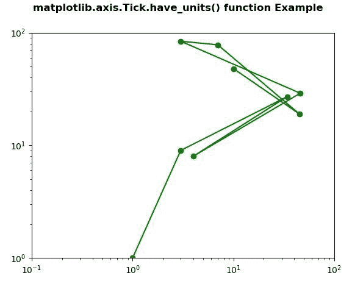

# Python 中的 matplotlib . axis . tick . have _ units()函数

> 原文:[https://www . geesforgeks . org/matplotlib-axis-tick-have _ units-function-in-python/](https://www.geeksforgeeks.org/matplotlib-axis-tick-have_units-function-in-python/)

[**Matplotlib**](https://www.geeksforgeeks.org/python-introduction-matplotlib/) 是 Python 中的一个库，是 NumPy 库的数值-数学扩展。这是一个神奇的 Python 可视化库，用于 2D 数组图，并用于处理更广泛的 SciPy 堆栈。

## matplotlib . axis . tick . have _ units()函数

matplotlib 库的轴模块中的 **Tick.have_units()功能**用于检查单位是否设置在任意轴上。

> **语法:**tick . has _ units(self)
> 
> **参数:**该方法不接受任何参数。
> 
> **返回值:**如果单位设置在任意轴上，该方法返回真。

以下示例说明 matplotlib . axis . tick . have _ units()函数在 matplotlib.axis:
**示例 1:**

## 蟒蛇 3

```
# Implementation of matplotlib function
from matplotlib.axis import Tick
import matplotlib.pyplot as plt  
import numpy as np  
from matplotlib.patches import Ellipse  

delta = 15.0

angles = np.arange(0, 360 + delta, delta)  
ells = [Ellipse((2, 2), 5, 2, a) for a in angles]  

fig, ax = plt.subplots()  

for e in ells:  
    Tick.set_clip_box(e, ax.bbox)
    e.set_facecolor("green")
    e.set_alpha(0.05)  
    ax.add_artist(e)  

plt.xlim(-1, 5)  
plt.ylim(-1, 5) 

ax.set_title("Units are set on any axis : "
              +str(Tick.have_units(ax.xaxis)))  

fig.suptitle('matplotlib.axis.Tick.have_units() \
function Example', fontweight ="bold")  

plt.show() 
```

**输出:**


**例 2:**

## 蟒蛇 3

```
# Implementation of matplotlib function
from matplotlib.axis import Tick
import matplotlib.pyplot as plt 

fig, ax1 = plt.subplots( ) 
ax1.set_xscale("log") 
ax1.set_yscale("log") 
ax1.set_adjustable("datalim") 

ax1.plot([1, 3, 34, 4, 46, 3, 7, 45, 10], 
         [1, 9, 27, 8, 29, 84, 78, 19, 48], 
          "o-", color ="green") 

ax1.set_xlim(1e-1, 1e2) 
ax1.set_ylim(1, 1e2) 

w = Tick.have_units(ax1.yaxis) 

print("Value Return by have_units() :", w)    

fig.suptitle('matplotlib.axis.Tick.have_units() \
function Example', fontweight ="bold")  

plt.show() 
```

**输出:**



```
Value Return by have_units() : False

```