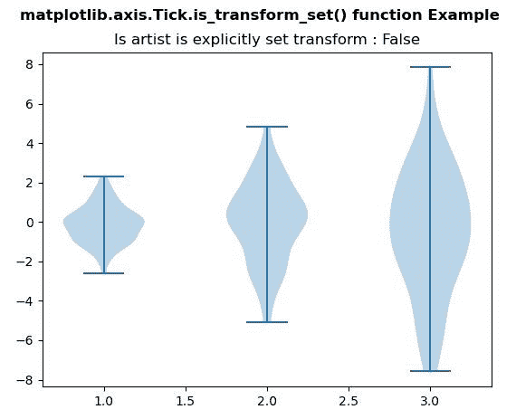
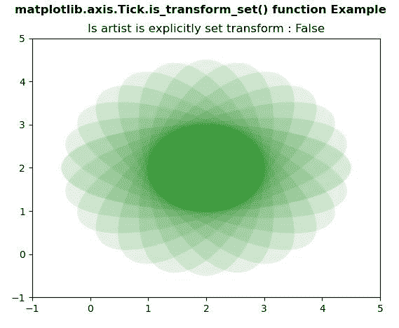

# Python 中的 matplotlib . axis . tick . is _ transform _ set()函数

> 原文:[https://www . geesforgeks . org/matplotlib-axis-tick-is _ transform _ set-function-in-python/](https://www.geeksforgeeks.org/matplotlib-axis-tick-is_transform_set-function-in-python/)

[**Matplotlib**](https://www.geeksforgeeks.org/python-introduction-matplotlib/) 是 Python 中的一个库，是 NumPy 库的数值-数学扩展。这是一个神奇的 Python 可视化库，用于 2D 数组图，并用于处理更广泛的 SciPy 堆栈。

## matplotlib . axis . tick . is _ transform _ set()函数

matplotlib 库的轴模块中的 **Tick.is_transform_set()函数**用于获取 Artist 是否有显式设置的变换。

> **语法:** Tick.is_transform_set(自)
> 
> **参数:**该方法不接受任何参数。
> 
> **返回值:**该方法返回艺术家是否有显式设置的变换。

以下示例说明 matplotlib . axis . tick . is _ transform _ set()函数在 matplotlib.axis:
**示例 1:**

## 蟒蛇 3

```py
# Implementation of matplotlib function
from matplotlib.axis import Tick
import matplotlib.pyplot as plt  
import numpy as np  

# create test data  
np.random.seed(10**7)  
data = [sorted(np.random.normal(0, std, 100))   
       for std in range(1, 4)]  

fig, ax1 = plt.subplots()  
val = ax1.violinplot(data) 

ax1.set_title("Is artist is explicitly set transform : "
              +str(Tick.is_transform_set(ax1)))  

fig.suptitle('matplotlib.axis.Tick.is_transform_set() \
function Example', fontweight ="bold")  

plt.show() 
```

**输出:**



**例 2:**

## 蟒蛇 3

```py
# Implementation of matplotlib function
from matplotlib.axis import Tick
import matplotlib.pyplot as plt  
import numpy as np  
from matplotlib.patches import Ellipse  

delta = 15.0

angles = np.arange(0, 360 + delta, delta)  
ells = [Ellipse((2, 2), 5, 2, a) for a in angles]  

fig, ax = plt.subplots()  

for e in ells:  
    Tick.set_clip_box(e, ax.bbox)
    e.set_facecolor("green")
    e.set_alpha(0.05)  
    ax.add_artist(e)  

plt.xlim(-1, 5)  
plt.ylim(-1, 5) 

ax.set_title("Is artist is explicitly set transform : "
              +str(Tick.is_transform_set(ax)))  

fig.suptitle('matplotlib.axis.Tick.is_transform_set() \
function Example', fontweight ="bold")  

plt.show() 
```

**输出:**

