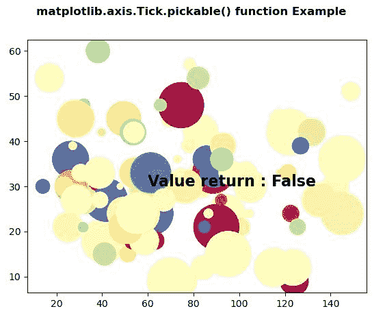
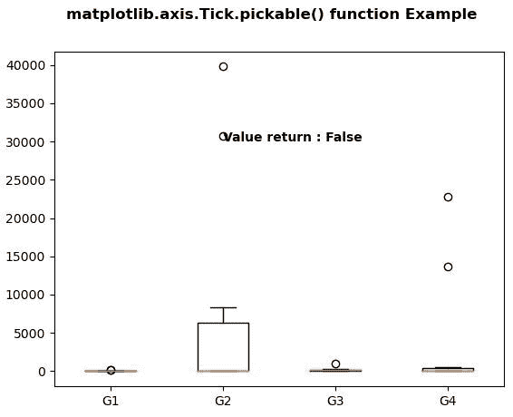

# Python 中的 Matplotlib.axis.Tick.pickable()函数

> 原文:[https://www . geeksforgeeks . org/matplotlib-axis-tick-pick able-python 中的函数/](https://www.geeksforgeeks.org/matplotlib-axis-tick-pickable-function-in-python/)

[**Matplotlib**](https://www.geeksforgeeks.org/python-introduction-matplotlib/) 是 Python 中的一个库，是 NumPy 库的数值-数学扩展。这是一个神奇的 Python 可视化库，用于 2D 数组图，并用于处理更广泛的 SciPy 堆栈。

## Matplotlib.axis.Tick.pickable()函数

matplotlib 库轴模块中的 **Tick.pickable()函数**用于返回艺术家是否可拾取。

> **语法:**勾选可选择(自我)
> 
> **参数:**此方法不接受任何参数。
> 
> **返回值:**此方法返回艺人是否可挑。

以下示例说明 matplotlib.axis.Tick.pickable()函数在 matplotlib.axis:
**示例 1:**

## 蟒蛇 3

```py
# Implementation of matplotlib function
from matplotlib.axis import Tick
import numpy as np  
np.random.seed(19680801)  
import matplotlib.pyplot as plt  

volume = np.random.rayleigh(27, size = 100)  
amount = np.random.poisson(10, size = 100)  
ranking = np.random.normal(size = 100)  
price = np.random.uniform(1, 10, size = 100)  

fig, ax = plt.subplots()  

scatter = ax.scatter(volume * 2, amount * 3,  
                     c = ranking ** 3,   
                     s = (price * 5)**2,  
                     vmin = -4, vmax = 4,   
                     cmap = "Spectral")  

ax.text(60, 30, "Value return : "
        + str(Tick.pickable(ax)),   
        fontweight ="bold",   
        fontsize = 16)

fig.suptitle('matplotlib.axis.Tick.pickable() \
function Example', fontweight ="bold")  

plt.show() 
```

**输出:**



**例 2:**

## 蟒蛇 3

```py
# Implementation of matplotlib function
from matplotlib.axis import Tick
import numpy as np  
import matplotlib.pyplot as plt  
import matplotlib.cbook as cbook  

np.random.seed(10**7)  
data = np.random.lognormal(size =(10, 4),  
                           mean = 4.5,  
                           sigma = 4.75)  

labels = ['G1', 'G2', 'G3', 'G4']  

result = cbook.boxplot_stats(data,   
                             labels = labels,   
                             bootstrap = 1000)  

fig, axes1 = plt.subplots()  
axes1.bxp(result)  

axes1.text(2, 30000,  
           "Value return : "
           + str(Tick.pickable(axes1)),   
           fontweight ="bold")

fig.suptitle('matplotlib.axis.Tick.pickable() \
function Example', fontweight ="bold")  

plt.show() 
```

**输出:**

