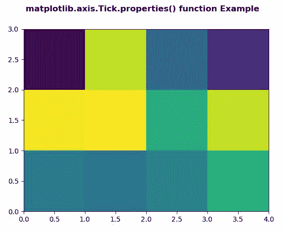
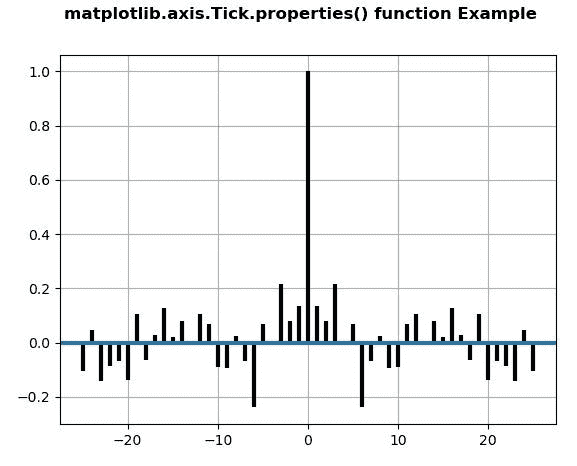

# Python 中的 matplotlib . axis . tick . properties()函数

> 原文:[https://www . geeksforgeeks . org/matplotlib-axis-tick-properties-function-in-python/](https://www.geeksforgeeks.org/matplotlib-axis-tick-properties-function-in-python/)

[**Matplotlib**](https://www.geeksforgeeks.org/python-introduction-matplotlib/) 是 Python 中的一个库，是 NumPy 库的数值-数学扩展。这是一个神奇的 Python 可视化库，用于 2D 数组图，并用于处理更广泛的 SciPy 堆栈。

## matplotlib . axis . tick . properties()函数

matplotlib 库的轴模块中的 **Tick.properties()函数**用来获取艺术家所有属性的字典。

> **语法:** Tick.properties(self)
> 
> **参数:**该方法不接受任何参数。
> 
> **返回值:**此方法返回艺术家所有属性的字典。

以下示例说明 matplotlib . axis . tick . properties()函数在 matplotlib.axis:
**示例 1:**

## 蟒蛇 3

```py
# Implementation of matplotlib function
from matplotlib.axis import Tick
import numpy as np   
import matplotlib.pyplot as plt   

xx = np.random.rand(3, 4)   

fig, ax = plt.subplots()   

m = ax.pcolor(xx)   
m.set_zorder(2)  

w = Tick.properties(ax)  
print("Display first 10 Properties\n")  
for i in list(w)[:10]:  
    print(i, ":", w[i]) 

fig.suptitle('matplotlib.axis.Tick.properties() \
function Example', fontweight ="bold")  

plt.show() 
```

**输出:**



```py
Display first 10 Properties

adjustable : box
agg_filter : None
alpha : None
anchor : C
animated : False
aspect : auto
autoscale_on : True
autoscalex_on : True
autoscaley_on : True
axes_locator : None

```

**例 2:**

## 蟒蛇 3

```py
# Implementation of matplotlib function
from matplotlib.axis import Tick
import matplotlib.pyplot as plt  
import numpy as np  

np.random.seed(10**7)  
geeks = np.random.randn(100)  

fig, ax = plt.subplots()  
ax.acorr(geeks, usevlines = True,  
         normed = True,  
         maxlags = 25, lw = 3)  

ax.grid(True)  

w = Tick.properties(ax)  
print("Display last 10 Properties\n")  
for i in list(w)[-10:]:  
    print(i, ":", w[i]) 

fig.suptitle('matplotlib.axis.Tick.properties() \
function Example', fontweight ="bold")  

plt.show() 
```

**输出:**



```py
Display last 10 Properties

ygridlines : 
ylabel : 
ylim : (-0.300605326634452, 1.061933586982593)
ymajorticklabels : 
yminorticklabels : 
yscale : linear
yticklabels : 
yticklines : 
yticks : [-0.4 -0.2  0\.   0.2  0.4  0.6  0.8  1\.   1.2]
zorder : 0

```