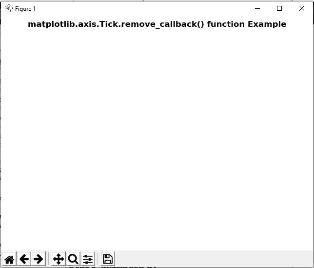

# Python 中的 matplotlib . axis . tick . remove _ callback()函数

> 原文:[https://www . geesforgeks . org/matplotlib-axis-tick-remove _ callback-python 中的函数/](https://www.geeksforgeeks.org/matplotlib-axis-tick-remove_callback-function-in-python/)

[**Matplotlib**](https://www.geeksforgeeks.org/python-introduction-matplotlib/) 是 Python 中的一个库，是 NumPy 库的数值-数学扩展。这是一个神奇的 Python 可视化库，用于 2D 数组图，并用于处理更广泛的 SciPy 堆栈。

## matplotlib . axis . tick . remove _ callback()函数

matplotlib 库的 axis 模块中的 **Tick.remove_callback()函数**用于根据观察器 id 移除回调。

> **语法:** Tick.remove_callback(self，oid)
> 
> **参数:**该方法接受以下参数。
> 
> *   **oid:** 这个参数是观察者 id。
> 
> **返回值:**此方法不返回值。

以下示例说明 matplotlib . axis . tick . remove _ callback()函数在 matplotlib.axis:
**示例 1:**

## 蟒蛇 3

```py
# Implementation of matplotlib function
from matplotlib.axis import Tick
import matplotlib.pyplot as plt 
import numpy as np 
import time 

def update(): 
    global timer 
    plt.get_current_fig_manager().canvas.figure.patch.set_facecolor(str(np.random.random())) 
    plt.draw() 

def start_animation(): 
    global it 
    timer = fig.canvas.new_timer(interval = 50) 
    w = timer.add_callback(update) 
    timer.start() 
    timer.remove_callback(w) 

it = 1
fig = plt.figure() 
start_animation()  

fig.suptitle('matplotlib.axis.Tick.remove_callback() \
function Example', fontweight ="bold")  

plt.show() 
```

**输出:**



**例 2:**

## 蟒蛇 3

```py
# Implementation of matplotlib function
from matplotlib.axis import Tick
from random import randint, choice  
import time  
import matplotlib.pyplot as plt  
import matplotlib.patches as patches  

back_color = "black"
colors = ['red', 'green', 'blue', 'purple', "yellow", "pink"]  
width, height = 4, 4

fig = plt.figure()  
plt.xlim([0, width]) 
plt.ylim([0, height])  

fig.canvas.draw()  

it = 1
def update(): 
    global it 
    x = randint(0, width - 1)  
    y = randint(0, height - 1)  

    arti = patches.Rectangle(  
        (x, y), 1, 1,  
        facecolor = choice(colors),  
        edgecolor = back_color  
    )  

    fig.add_artist(arti) 
    fig.draw_artist(arti) 
    fig.canvas.blit(fig.bbox) 

    if it > 100: 
        timer.remove_callback(w) 
    it += 1

timer = fig.canvas.new_timer(interval = 1)  
w = timer.add_callback(update)  
timer.start()   

fig.suptitle('matplotlib.axis.Tick.remove_callback() \
function Example', fontweight ="bold")  

plt.show() 
```

**输出:**

<video class="wp-video-shortcode" id="video-428552-1" width="665" height="374" preload="metadata" controls=""><source type="video/webm" src="https://media.geeksforgeeks.org/wp-content/cdn-uploads/20200610193248/python-matplotlib-remove-callback-tick-axis.webm?_=1">[https://media.geeksforgeeks.org/wp-content/cdn-uploads/20200610193248/python-matplotlib-remove-callback-tick-axis.webm](https://media.geeksforgeeks.org/wp-content/cdn-uploads/20200610193248/python-matplotlib-remove-callback-tick-axis.webm)</video>