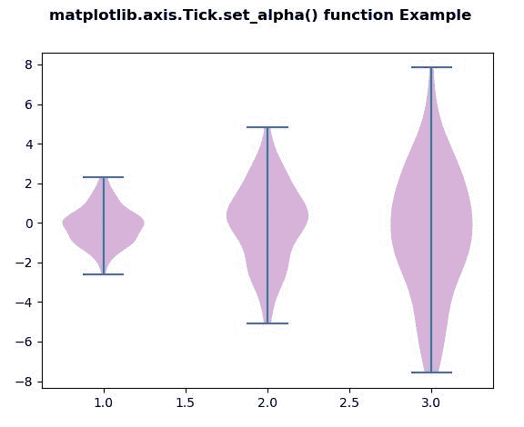
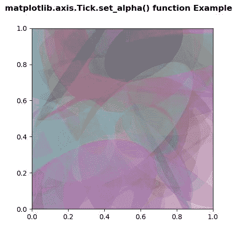

# Python 中的 Matplotlib.axis.Tick.set_alpha()函数

> 原文:[https://www . geesforgeks . org/matplotlib-axis-tick-set _ alpha-python 中的函数/](https://www.geeksforgeeks.org/matplotlib-axis-tick-set_alpha-function-in-python/)

[**Matplotlib**](https://www.geeksforgeeks.org/python-introduction-matplotlib/) 是 Python 中的一个库，是 NumPy 库的数值-数学扩展。这是一个神奇的 Python 可视化库，用于 2D 数组图，并用于处理更广泛的 SciPy 堆栈。

## Matplotlib.axis.Tick.set_alpha()函数

matplotlib 库的轴模块中的 **Tick.set_alpha()函数**用于设置用于混合的 alpha 值。

> **语法:** Tick.set_alpha(self，alpha)
> 
> **参数:**该方法接受以下参数。
> 
> *   **alpha:** 此参数为包含浮点值或无。
> 
> **返回值:**此方法不返回值。

以下示例说明 matplotlib.axis.Tick.set_alpha()函数在 matplotlib.axis:
**示例 1:**

## 蟒蛇 3

```
# Implementation of matplotlib function
from matplotlib.axis import Tick
import matplotlib.pyplot as plt  
import numpy as np  

# create test data  
np.random.seed(10**7)  
data = [sorted(np.random.normal(0, std, 100))   
       for std in range(1, 4)]  

fig, ax1 = plt.subplots()  
val = ax1.violinplot(data)   

for i in val['bodies']:  
    i.set_facecolor('purple')  
    Tick.set_alpha(i, 0.4)

fig.suptitle('matplotlib.axis.Tick.set_alpha() \
function Example', fontweight ="bold")  

plt.show() 
```

**输出:**



**例 2:**

## 蟒蛇 3

```
# Implementation of matplotlib function
from matplotlib.axis import Tick
import matplotlib.pyplot as plt  
import numpy as np  
from matplotlib.patches import Ellipse  

NUM = 100

ells = [Ellipse(xy = np.random.rand(2),  
                width = np.random.rand(),   
                height = np.random.rand(),  
                angle = np.random.rand() * 360)  
        for i in range(NUM)]  

fig, ax = plt.subplots(subplot_kw ={'aspect': 'equal'})  

for e in ells:  
    ax.add_artist(e)  
    e.set_clip_box(ax.bbox)   
    e.set_facecolor(np.random.rand(4))
    Tick.set_alpha(e,0.2) 

fig.suptitle('matplotlib.axis.Tick.set_alpha() \
function Example', fontweight ="bold")  

plt.show() 
```

**输出:**

