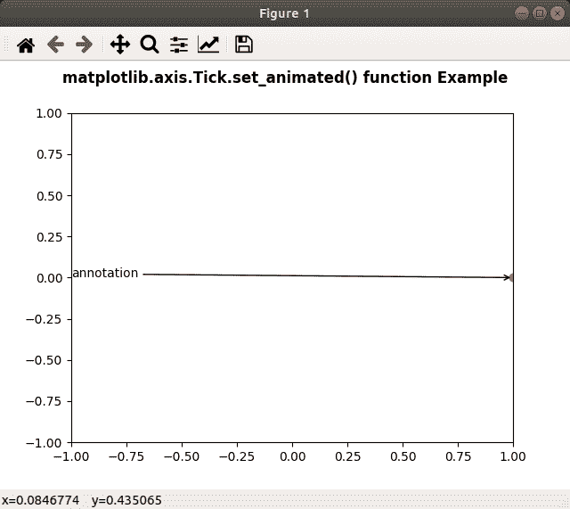

# Python 中的 matplotlib . axis . tick . set _ animated()函数

> 原文:[https://www . geesforgeks . org/matplotlib-axis-tick-set _ animated-function-in-python/](https://www.geeksforgeeks.org/matplotlib-axis-tick-set_animated-function-in-python/)

[**Matplotlib**](https://www.geeksforgeeks.org/python-introduction-matplotlib/) 是 Python 中的一个库，是 NumPy 库的数值-数学扩展。这是一个神奇的 Python 可视化库，用于 2D 数组图，并用于处理更广泛的 SciPy 堆栈。

## matplotlib . axis . tick . set _ animated()函数

matplotlib 库的轴模块中的 **Tick.set_animated()函数**用于设置艺术家的动画状态。

> **语法:** Tick.set_animated(self，b)
> **参数:**此方法接受以下参数。
> 
> *   **b:** 该参数为布尔值。
> 
> **返回值:**此方法不返回值。

以下示例说明 matplotlib . axis . tick . set _ animated()函数在 matplotlib.axis:
**示例 1:**

## 蟒蛇 3

```
# Implementation of matplotlib function
from matplotlib.axis import Tick
import numpy as np  
import matplotlib.pyplot as plt  
import matplotlib.animation as animation  

data = np.array([[1, 2, 3, 4, 5],   
                 [7, 4, 9, 2, 3]])  

fig = plt.figure()  
ax = plt.axes(xlim =(0, 20), ylim =(0, 20))  

line, = ax.plot([], [], 'r-')  
annotation = ax.annotate('',  
                         xy =(data[0][0],  
                              data[1][0]))  

Tick.set_animated(annotation, True)  

def init():  
    return line, annotation  

def update(num):  
    newData = np.array([[1 + num,  
                         2 + num / 2,  
                         3,  
                         4 - num / 4,  
                         5 + num],  
                        [7, 4,   
                         9 + num / 3,  
                         2, 3]])  

    line.set_data(newData)  
    return line, annotation  

anim = animation.FuncAnimation(fig,  
                               update,   
                               frames = 59,  
                               init_func = init,  
                               interval = 60,  
                               blit = True)  

fig.suptitle('matplotlib.axis.Tick.set_animated() \
function Example', fontweight ="bold")  

plt.show() 
```

**输出:**

<video class="wp-video-shortcode" id="video-429050-1" width="665" height="374" preload="metadata" controls=""><source type="video/webm" src="https://media.geeksforgeeks.org/wp-content/cdn-uploads/20200611141317/python-matplotlib-set-animation-tick-1.webm?_=1">[https://media.geeksforgeeks.org/wp-content/cdn-uploads/20200611141317/python-matplotlib-set-animation-tick-1.webm](https://media.geeksforgeeks.org/wp-content/cdn-uploads/20200611141317/python-matplotlib-set-animation-tick-1.webm)</video>

**例 2:**

## 蟒蛇 3

```
# Implementation of matplotlib function
from matplotlib.axis import Tick
import numpy as np  
import matplotlib.pyplot as plt  
import matplotlib.animation as animation  

fig, ax = plt.subplots()  

ax.set_xlim([-1, 1])  
ax.set_ylim([-1, 1])  

L = 50
theta = np.linspace(0, 2 * np.pi, L)  
r = np.ones_like(theta)  

x = r * np.cos(theta)  
y = r * np.sin(theta)  

line, = ax.plot(1, 0, 'ro')  

annotation = ax.annotate(  
    'annotation', xy =(1, 0), xytext =(-1, 0),  
    arrowprops = {'arrowstyle': "->"}  
)  
Tick.set_animated(annotation, False) 

fig.suptitle('matplotlib.axis.Tick.set_animated() \
function Example', fontweight ="bold")  

plt.show() 
```

