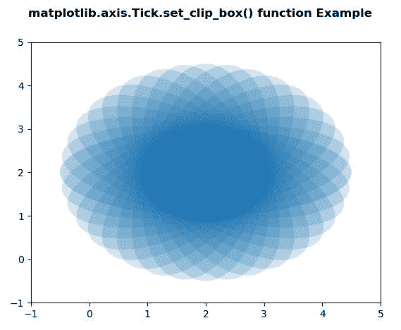
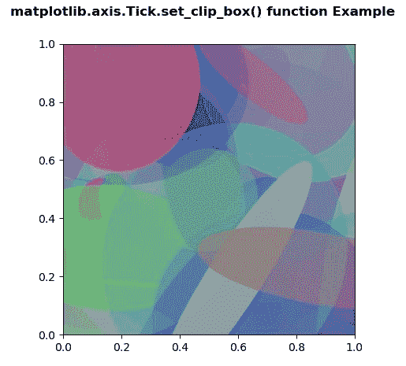

# Python 中的 matplotlib . axis . tick . set _ clip _ box()函数

> 原文:[https://www . geeksforgeeks . org/matplotlib-axis-tick-set _ clip _ box-python 中的函数/](https://www.geeksforgeeks.org/matplotlib-axis-tick-set_clip_box-function-in-python/)

[**Matplotlib**](https://www.geeksforgeeks.org/python-introduction-matplotlib/) 是 Python 中的一个库，是 NumPy 库的数值-数学扩展。这是一个神奇的 Python 可视化库，用于 2D 数组图，并用于处理更广泛的 SciPy 堆栈。

## matplotlib . axis . tick . set _ clip _ box()函数

matplotlib 库的轴模块中的 **Tick.set_clip_box()函数**用于设置艺术家的剪辑 Bbox。

> **语法:**勾选. set_clip_box(self，clipbox)
> 
> **参数:**该方法接受以下参数。
> 
> *   **剪贴簿:**这个参数是 Bbox。
> 
> **返回值:**此方法不返回值。

以下示例说明 matplotlib . axis . tick . set _ clip _ box()函数在 matplotlib.axis:
**示例 1:**

## 蟒蛇 3

```
# Implementation of matplotlib function
from matplotlib.axis import Tick
import matplotlib.pyplot as plt  
import numpy as np  
from matplotlib.patches import Ellipse  

delta = 10.0

angles = np.arange(0, 360 + delta, delta)  
ells = [Ellipse((2, 2), 5, 2, a) for a in angles]  

fig, ax = plt.subplots()  

for e in ells:  
    Tick.set_clip_box(e, ax.bbox)  
    e.set_alpha(0.1)  
    ax.add_artist(e)  

plt.xlim(-1, 5)  
plt.ylim(-1, 5) 

fig.suptitle('matplotlib.axis.Tick.set_clip_box() \
function Example', fontweight ="bold")  

plt.show() 
=
```

**输出:**



**例 2:**

## 蟒蛇 3

```
# Implementation of matplotlib function
from matplotlib.axis import Tick
import matplotlib.pyplot as plt  
import numpy as np  
from matplotlib.patches import Ellipse  

NUM = 200

ells = [Ellipse(xy = np.random.rand(2),  
                width = np.random.rand(),   
                height = np.random.rand(),  
                angle = np.random.rand() * 360)  
        for i in range(NUM)]  

fig, ax = plt.subplots(subplot_kw ={'aspect': 'equal'})  

for e in ells:  
    ax.add_artist(e) 
    Tick.set_clip_box(e, ax.bbox)  
    e.set_clip_box(ax.bbox)  
    e.set_alpha(np.random.rand())  
    e.set_facecolor(np.random.rand(4))  

fig.suptitle('matplotlib.axis.Tick.set_clip_box() \
function Example', fontweight ="bold")  

plt.show() 
```

**输出:**

