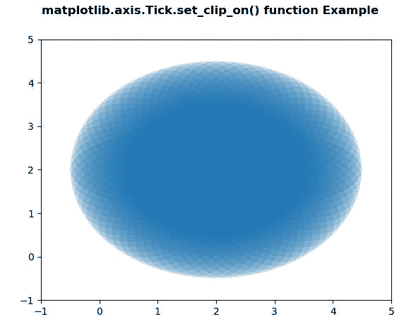
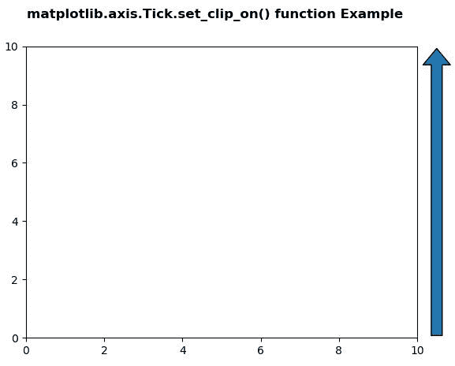

# Python 中的 matplotlib . axis . tick . set _ clip _ on()函数

> 原文:[https://www . geeksforgeeks . org/matplotlib-axis-tick-set _ clip _ on-function-in-python/](https://www.geeksforgeeks.org/matplotlib-axis-tick-set_clip_on-function-in-python/)

[**Matplotlib**](https://www.geeksforgeeks.org/python-introduction-matplotlib/) 是 Python 中的一个库，是 NumPy 库的数值-数学扩展。这是一个神奇的 Python 可视化库，用于 2D 数组图，并用于处理更广泛的 SciPy 堆栈。

## matplotlib . axis . tick . set _ clip _ on()函数

matplotlib 库的轴模块中的 **Tick.set_clip_on()功能**用于设置艺术家是否使用剪裁。

> **语法:** Tick.set_clip_on(self，b)
> 
> **参数:**该方法接受以下参数。
> 
> *   **b:** 该参数包含布尔值。
> 
> **返回值:**此方法不返回值。

以下示例说明 matplotlib . axis . tick . set _ clip _ on()函数在 matplotlib.axis:
**示例 1:**

## 蟒蛇 3

```
# Implementation of matplotlib function
from matplotlib.axis import Tick
import matplotlib.pyplot as plt  
import numpy as np  
from matplotlib.patches import Ellipse  

delta = 5.0

angles = np.arange(0, 360 + delta, delta)  
ells = [Ellipse((2, 2), 5, 2, a) for a in angles]  

fig, ax = plt.subplots()  

for e in ells:  
    e.set_alpha(0.1)  
    ax.add_artist(e)  

ax.set_xlim(-1, 5)  
ax.set_ylim(-1, 5)  
Tick.set_clip_on(ax, b = False)

fig.suptitle('matplotlib.axis.Tick.set_clip_on() \
function Example', fontweight ="bold")  

plt.show() 
```

**输出:**



**例 2:**

## 蟒蛇 3

```
# Implementation of matplotlib function
from matplotlib.axis import Tick
import matplotlib.pyplot as plt  
import matplotlib.patches as mpatches  
import matplotlib.transforms as mtransforms  

x0 = 1.05

arrow_style ="simple, head_length = 15, \
head_width = 25, tail_width = 10"  
rect_style ="simple, tail_width = 25"
line_style ="simple, tail_width = 1"

fig, ax = plt.subplots()  

trans = mtransforms.blended_transform_factory(ax.transAxes, 
                                              ax.transData)  

y_tail = 0
y_head = 10
arrow1 = mpatches.FancyArrowPatch((x0, y_tail),   
                                  (x0, y_head),  
                                   arrowstyle = arrow_style,  
                                   transform = trans) 

Tick.set_clip_on(arrow1, b = False) 
ax.add_patch(arrow1)  

ax.set_xlim(0, 10)  
ax.set_ylim(0, 10) 

fig.suptitle('matplotlib.axis.Tick.set_clip_on() \
function Example', fontweight ="bold")  

plt.show() 
```

**输出:**

