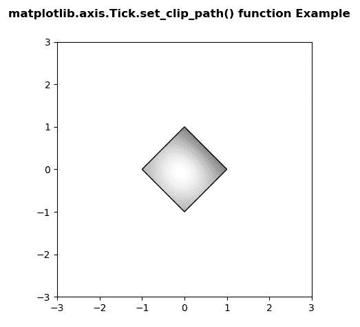

# Python 中的 matplotlib . axis . tick . set _ clip _ path()函数

> 原文:[https://www . geeksforgeeks . org/matplotlib-axis-tick-set _ clip _ path-python 中的函数/](https://www.geeksforgeeks.org/matplotlib-axis-tick-set_clip_path-function-in-python/)

[**Matplotlib**](https://www.geeksforgeeks.org/python-introduction-matplotlib/) 是 Python 中的一个库，是 NumPy 库的数值-数学扩展。这是一个神奇的 Python 可视化库，用于 2D 数组图，并用于处理更广泛的 SciPy 堆栈。

## matplotlib . axis . tick . set _ clip _ path()函数

matplotlib 库的轴模块中的 **Tick.set_clip_path()函数**用于设置艺术家的剪辑路径。

> **语法:** Tick.set_clip_path(自身，路径，变换=无)
> 
> **参数:**该方法接受以下参数。
> 
> *   **路径:**此参数为剪辑路径。
> *   **变换:**使用变换将路径转换为已变换路径的参数。
> 
> **返回值:**此方法不返回值。

以下示例说明 matplotlib . axis . tick . set _ clip _ path()函数在 matplotlib.axis:
**示例 1:**
**输入图像**


## 蟒蛇 3

```py
# Implementation of matplotlib function
from matplotlib.axis import Tick
import matplotlib.pyplot as plt  
import matplotlib.patches as patches  
import matplotlib.cbook as cbook  

with cbook.get_sample_data('geeksforgeeks-logo1.PNG') as image_file:  
    image = plt.imread(image_file)  

fig, ax = plt.subplots()  
ax.imshow(image)  
patch = patches.Rectangle((10, 10),  
                          560,  
                          500,   
                          transform = ax.transData)  

ax.set_clip_path(patch) 

fig.suptitle('matplotlib.axis.Tick.set_clip_path() \
function Example', fontweight ="bold")  

plt.show() 
```

**输出:**


**例 2:**

## 蟒蛇 3

```py
# Implementation of matplotlib function
from matplotlib.axis import Tick
import numpy as np  
import matplotlib.cm as cm  
import matplotlib.pyplot as plt  
from matplotlib.path import Path  
from matplotlib.patches import PathPatch  

delta = 0.025

x = y = np.arange(-3.0, 3.0, delta)  
X, Y = np.meshgrid(x, y)  

Z1 = np.exp(-X**2 - Y**2)  
Z2 = np.exp(-(X - 1)**2 - (Y - 1)**2)  
Z = (Z1 - Z2) * 2

path = Path([[0, 1], [1, 0], [0, -1],  
            [-1, 0], [0, 1]])  
patch = PathPatch(path, facecolor ='none')  

fig, ax = plt.subplots()  
ax.add_patch(patch)  

ax.imshow(Z,  
               interpolation ='bilinear',   
               cmap = cm.gray,  
               origin ='lower',   
               extent =[-3, 3, -3, 3],  
               clip_path = patch,   
               clip_on = True)  
ax.set_clip_path(patch)  

fig.suptitle('matplotlib.axis.Tick.set_clip_path() \
function Example', fontweight ="bold")  

plt.show() 
```

**输出:**

