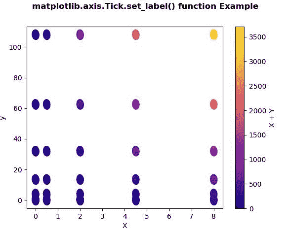
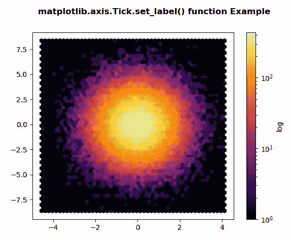

# Python 中的 Matplotlib.axis.Tick.set_label()函数

> 原文:[https://www . geesforgeks . org/matplotlib-axis-tick-set _ label-function-in-python/](https://www.geeksforgeeks.org/matplotlib-axis-tick-set_label-function-in-python/)

[**Matplotlib**](https://www.geeksforgeeks.org/python-introduction-matplotlib/) 是 Python 中的一个库，是 NumPy 库的数值-数学扩展。这是一个神奇的 Python 可视化库，用于 2D 数组图，并用于处理更广泛的 SciPy 堆栈。

## Matplotlib.axis.Tick.set_label()函数

matplotlib 库的轴模块中的 **Tick.set_label()函数**用于设置将在图例中显示的标签。

> **语法:** Tick.set_label(self，a)
> 
> **参数:**该方法接受以下参数。
> 
> *   **a:** 此参数通过调用 str 转换为字符串。
> 
> **返回值:**此方法不返回值。

以下示例说明 matplotlib.axis.Tick.set_label()函数在 matplotlib.axis:
**示例 1:**

## 蟒蛇 3

```
# Implementation of matplotlib function
from matplotlib.axis import Tick
import matplotlib.pyplot as plt  
import numpy as np  
from matplotlib.collections import EllipseCollection  

x = np.arange(5)  
y = np.arange(7)  
X, Y = np.meshgrid(x**2, y**3)  

XY = np.column_stack((X.ravel(), Y.ravel()))  

fig, ax = plt.subplots()  

ec = EllipseCollection(5, 7, 5, units ='y',  
                       offsets = XY * 0.5,  
                       transOffset = ax.transData,  
                       cmap ="plasma")  

ec.set_array((X * Y + X * X).ravel())  

ax.add_collection(ec)  
ax.autoscale_view()  

ax.set_xlabel('X')  
ax.set_ylabel('y')  

cbar = plt.colorbar(ec)  
cbar.set_label('X + Y')

fig.suptitle('matplotlib.axis.Tick.set_label() \
function Example', fontweight ="bold")  

plt.show() 
```

**输出:**



**例 2:**

## 蟒蛇 3

```
# Implementation of matplotlib function
from matplotlib.axis import Tick
import matplotlib.pyplot as plt  
import numpy as np  

np.random.seed(19680801)  

n = 100000
x = np.random.standard_normal(n)  
y = 2 * np.random.standard_normal(n)  
z =[1, 2, 3, 4]  

fig, ax = plt.subplots()  
hb = ax.hexbin(x, y, 
               gridsize = 50, 
               bins ='log', 
               cmap ='inferno')    

cb = fig.colorbar(hb, ax = ax)  
cb.set_label('log')

fig.suptitle('matplotlib.axis.Tick.set_label() \
function Example', fontweight ="bold")  

plt.show() 
```

**输出:**

