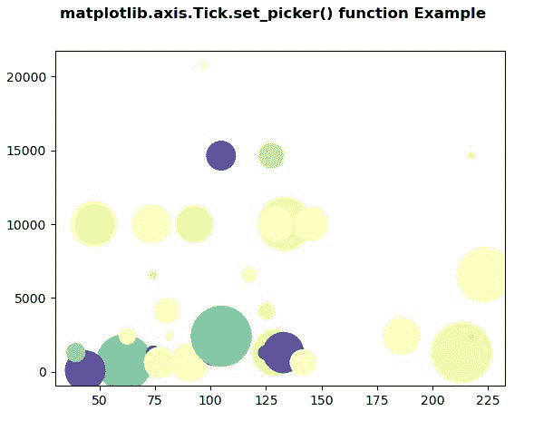
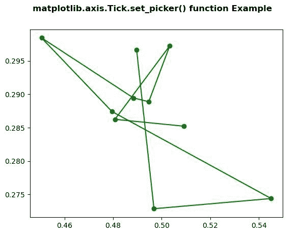

# Python 中的 matplotlib . axis . tick . set _ picker()函数

> 原文:[https://www . geesforgeks . org/matplotlib-axis-tick-set _ picker-python 中的函数/](https://www.geeksforgeeks.org/matplotlib-axis-tick-set_picker-function-in-python/)

[**Matplotlib**](https://www.geeksforgeeks.org/python-introduction-matplotlib/) 是 Python 中的一个库，是 NumPy 库的数值-数学扩展。这是一个神奇的 Python 可视化库，用于 2D 数组图，并用于处理更广泛的 SciPy 堆栈。

## matplotlib . axis . tick . set _ picker()函数

matplotlib 库的 axis 模块中的 **Tick.set_picker()函数**用于定义艺术家的拾取行为。

> **语法:** Tick.set_picker(self，picker)
> T3】参数:此方法接受以下参数。
> 
> *   **拣货员:**此参数用于设置拣货行为。这可以是无、布尔、浮点或函数。
> 
> **返回值:**此方法不返回值。

以下示例说明 matplotlib . axis . tick . set _ picker()函数在 matplotlib.axis:
**示例 1:**

## 蟒蛇 3

```py
# Implementation of matplotlib function
from matplotlib.axis import Tick
import numpy as np  
import matplotlib.pyplot as plt  

np.random.seed(19680801)  

volume = np.random.rayleigh(27, size = 40)  
amount = np.random.poisson(7, size = 40)  
ranking = np.random.normal(size = 40)  
price = np.random.uniform(1, 7, size = 40)  

fig, ax = plt.subplots()  

scatter = ax.scatter(volume * 3,   
                     amount**4,  
                     c = ranking**4,  
                     s = price**4,  
                     vmin = -3,  
                     vmax = 3,  
                     cmap ="Spectral")  

Tick.set_picker(ax, picker = 4) 

fig.suptitle('matplotlib.axis.Tick.set_picker() \
function Example', fontweight ="bold")  

plt.show() 
```

**输出:**



**例 2:**

## 蟒蛇 3

```py
# Implementation of matplotlib function
from matplotlib.axis import Tick
import numpy as np  
import matplotlib.pyplot as plt  

X = np.random.rand(10, 200)  
xs = np.mean(X, axis = 1)  
ys = np.std(X, axis = 1)  

fig = plt.figure()  
ax = fig.add_subplot(111)  
line, = ax.plot(xs, ys, 'go-')   

Tick.set_picker(ax, picker = True) 

fig.suptitle('matplotlib.axis.Tick.set_picker() \
function Example', fontweight ="bold")  

plt.show() 
```

**输出:**

