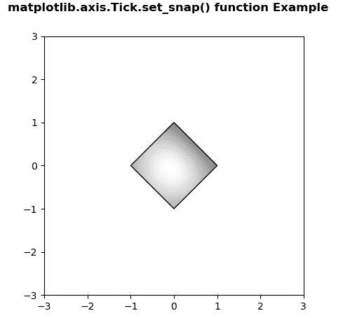

# Python 中的 Matplotlib.axis.Tick.set_snap()函数

> 原文:[https://www . geesforgeks . org/matplotlib-axis-tick-set _ snap-python 中的函数/](https://www.geeksforgeeks.org/matplotlib-axis-tick-set_snap-function-in-python/)

[**Matplotlib**](https://www.geeksforgeeks.org/python-introduction-matplotlib/) 是 Python 中的一个库，是 NumPy 库的数值-数学扩展。这是一个神奇的 Python 可视化库，用于 2D 数组图，并用于处理更广泛的 SciPy 堆栈。

## Matplotlib.axis.Tick.set_snap()函数

matplotlib 库的轴模块中的 **Tick.set_snap()函数**用于设置捕捉行为。

> **语法:**嘀嗒. set_snap(自我，snap)
> 
> **参数:**该方法接受以下参数。
> 
> *   **捕捉:**此参数包含布尔值或无。
> 
> **返回值:**此方法不返回值。

以下示例说明 matplotlib.axis.Tick.set_snap()函数在 matplotlib.axis:
**示例 1:**

## 蟒蛇 3

```
# Implementation of matplotlib function
from matplotlib.axis import Tick
import matplotlib.pyplot as plt  
from mpl_toolkits.axisartist.axislines import Subplot  

fig = plt.figure()  

ax = Subplot(fig, 111)  
fig.add_subplot(ax)  

ax.axis["left"].set_visible(False)  
ax.axis["top"].set_visible(False)  

Tick.set_snap(ax, True)  

fig.suptitle('matplotlib.axis.Tick.set_snap() \
function Example', fontweight ="bold")  

plt.show() 
```

**输出:**


**例 2:**

## 蟒蛇 3

```
# Implementation of matplotlib function
from matplotlib.axis import Tick
import numpy as np  
import matplotlib.cm as cm  
import matplotlib.pyplot as plt  
import matplotlib.cbook as cbook  
from matplotlib.path import Path  
from matplotlib.patches import PathPatch  

delta = 0.025

x = y = np.arange(-3.0, 3.0, delta)  
X, Y = np.meshgrid(x, y)  

Z1 = np.exp(-X**2 - Y**2)  
Z2 = np.exp(-(X - 1)**2 - (Y - 1)**2)  
Z = (Z1 - Z2) * 2

path = Path([[0, 1], [1, 0], [0, -1],  
            [-1, 0], [0, 1]])  
patch = PathPatch(path, facecolor ='none')  

fig, ax = plt.subplots()  
ax.add_patch(patch)  

im = ax.imshow(Z, interpolation ='bilinear',   
               cmap = cm.gray,  
               origin ='lower',  
               extent =[-3, 3, -3, 3],  
               clip_path = patch, clip_on = True)  

im.set_clip_path(patch) 

Tick.set_snap(im, None)   

fig.suptitle('matplotlib.axis.Tick.set_snap() \
function Example', fontweight ="bold")  

plt.show() 
```

**输出:**

