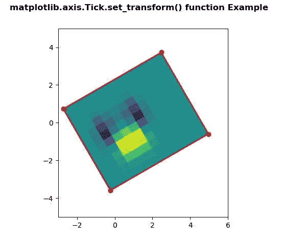
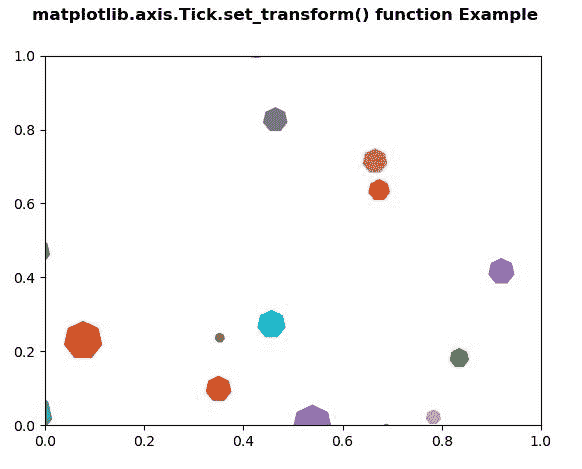

# Python 中的 matplotlib . axis . tick . set _ transform()函数

> 原文:[https://www . geesforgeks . org/matplotlib-axis-tick-set _ transform-python 中的函数/](https://www.geeksforgeeks.org/matplotlib-axis-tick-set_transform-function-in-python/)

[**Matplotlib**](https://www.geeksforgeeks.org/python-introduction-matplotlib/) 是 Python 中的一个库，是 NumPy 库的数值-数学扩展。这是一个神奇的 Python 可视化库，用于 2D 数组图，并用于处理更广泛的 SciPy 堆栈。

## matplotlib . axis . tick . set _ transform()函数

matplotlib 库的轴模块中的 **Tick.set_transform()函数**用于设置艺术家变换。

> **语法:** Tick.set_transform(self，t)
> 
> **参数:**该方法接受以下参数。
> 
> *   **t:** 此参数为变换。
> 
> **返回值:**此方法不返回值。

以下示例说明 matplotlib . axis . tick . set _ transform()函数在 matplotlib.axis:
**示例 1:**

## 蟒蛇 3

```
# Implementation of matplotlib function
from matplotlib.axis import Tick
import numpy as np  
import matplotlib.pyplot as plt  
import matplotlib.transforms as mtransforms  

delta = 0.5

x = y = np.arange(-2.0, 4.0, delta)  
X, Y = np.meshgrid(x**2, y)  

Z1 = np.exp(-X**2 - Y**2)  
Z2 = np.exp(-(X - 1)**2 - (Y - 1)**2)  
Z = (Z1 - Z2)  

transform = mtransforms.Affine2D().rotate_deg(30)  
fig, ax = plt.subplots()  

im = ax.imshow(Z, interpolation ='none',  
               origin ='lower',  
               extent =[-2, 4, -3, 2],   
               clip_on = True)  

trans_data = transform + ax.transData  
Tick.set_transform(im, trans_data)  

x1, x2, y1, y2 = im.get_extent()  
ax.plot([x1, x2, x2, x1, x1],   
        [y1, y1, y2, y2, y1],  
        "ro-",  
        transform = trans_data)  

ax.set_xlim(-3, 6)  
ax.set_ylim(-5, 5)

fig.suptitle('matplotlib.axis.Tick.set_transform() \
function Example', fontweight ="bold")  

plt.show() 
```

**输出:**



**例 2:**

## 蟒蛇 3

```
# Implementation of matplotlib function
from matplotlib.axis import Tick
import matplotlib.pyplot as plt  
from matplotlib import collections, colors, transforms  
import numpy as np  

nverts = 50
npts = 100

r = np.arange(nverts)  
theta = np.linspace(0, 2 * np.pi, nverts)  

xx = r * np.sin(theta)  
yy = r * np.cos(theta)  

spiral = np.column_stack([xx, yy])  

rs = np.random.RandomState(19680801)  

xyo = rs.randn(npts, 2)  

colors = [colors.to_rgba(c)  
          for c in plt.rcParams['axes.prop_cycle'].by_key()['color']]  

fig, ax1 = plt.subplots()  

col = collections.RegularPolyCollection(  
    7, sizes = np.abs(xx) * 10.0,   
    offsets = xyo,   
    transOffset = ax1.transData)  

trans = transforms.Affine2D().scale(fig.dpi / 72.0)  
Tick.set_transform(col, trans)   

ax1.add_collection(col, autolim = True)  
col.set_color(colors) 

fig.suptitle('matplotlib.axis.Tick.set_transform() \
function Example', fontweight ="bold")  

plt.show() 
```

**输出:**

