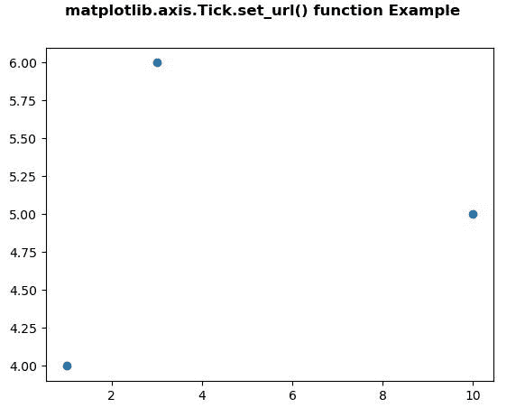
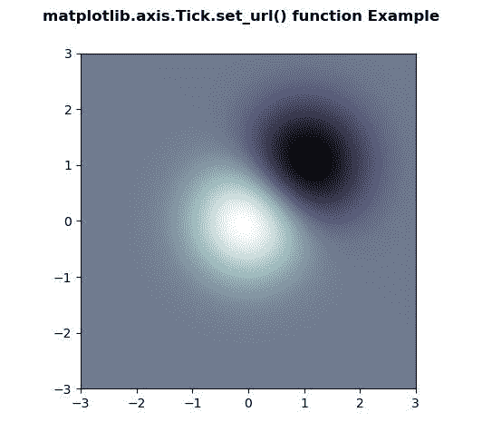

# Python 中的 Matplotlib.axis.Tick.set_url()函数

> 原文:[https://www . geesforgeks . org/matplotlib-axis-tick-set _ URL-python 中的函数/](https://www.geeksforgeeks.org/matplotlib-axis-tick-set_url-function-in-python/)

[**Matplotlib**](https://www.geeksforgeeks.org/python-introduction-matplotlib/) 是 Python 中的一个库，是 NumPy 库的数值-数学扩展。这是一个神奇的 Python 可视化库，用于 2D 数组图，并用于处理更广泛的 SciPy 堆栈。

## Matplotlib.axis.Tick.set_url()函数

matplotlib 库的 axis 模块中的 **Tick.set_url()函数**用于为艺术家设置 url。

> **语法:** Tick.set_url(自我，url)
> 
> **参数:**该方法接受以下参数。
> 
> *   **url:** 此参数是包含 url 的字符串。
> 
> **返回值:**此方法不返回值。

以下示例说明 matplotlib.axis.Tick.set_url()函数在 matplotlib.axis:
**示例 1:**

## 蟒蛇 3

```
# Implementation of matplotlib function
from matplotlib.axis import Tick
import numpy as np   
import matplotlib.pyplot as plt 

fig, ax = plt.subplots()  
s = ax.scatter([1, 10, 3], [4, 5, 6])

Tick.set_url(s, 'http://www.google.com')  
fig.canvas.print_figure('geeks1.svg')

fig.suptitle('matplotlib.axis.Tick.set_url() \
function Example', fontweight ="bold")  

plt.show() 
```

**输出:**



**例 2:**

## 蟒蛇 3

```
# Implementation of matplotlib function
from matplotlib.axis import Tick
import numpy as np   
import matplotlib.pyplot as plt 

fig, ax = plt.subplots()  
delta = 0.025

x = y = np.arange(-3.0, 3.0, delta)  
X, Y = np.meshgrid(x, y)  

Z1 = np.exp(-X**2 - Y**2)  
Z2 = np.exp(-(X - 1)**2 - (Y - 1)**2)  
Z = (Z1 - Z2) * 2

im = ax.imshow(Z,  
               interpolation ='bilinear',  
               cmap = "bone",  
               origin ='lower',   
               extent =[-3, 3, -3, 3])

Tick.set_url(im, 'http://www.google.com')  
fig.canvas.print_figure('geeks2.svg') 

fig.suptitle('matplotlib.axis.Tick.set_url() \
function Example', fontweight ="bold")  

plt.show() 
```

**输出:**

