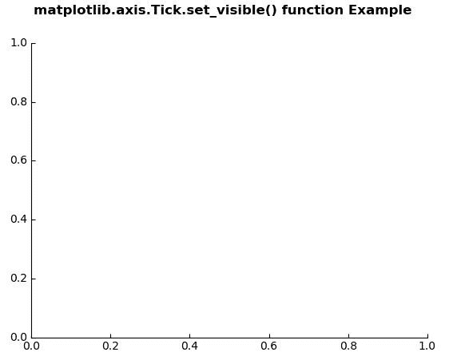
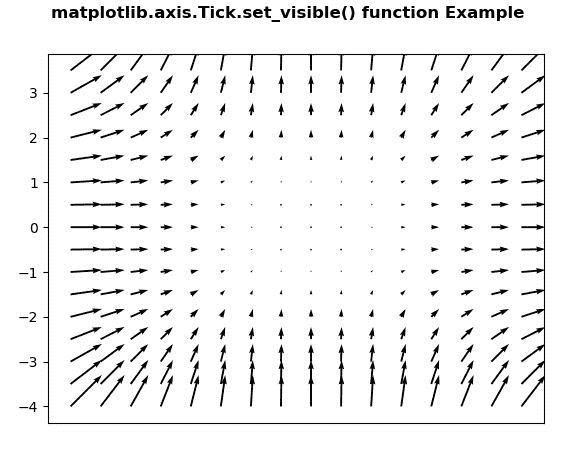

# Python 中的 matplotlib . axis . tick . set _ visible()函数

> 原文:[https://www . geesforgeks . org/matplotlib-axis-tick-set _ visible-python 中的函数/](https://www.geeksforgeeks.org/matplotlib-axis-tick-set_visible-function-in-python/)

[**Matplotlib**](https://www.geeksforgeeks.org/python-introduction-matplotlib/) 是 Python 中的一个库，是 NumPy 库的数值-数学扩展。这是一个神奇的 Python 可视化库，用于 2D 数组图，并用于处理更广泛的 SciPy 堆栈。

## matplotlib . axis . tick . set _ visible()函数

matplotlib 库的轴模块中的 **Tick.set_visible()函数**用于将属性从他人复制到自己。

> **语法:** Tick.set_visible(self，b)
> 
> **参数:**该方法接受以下参数。
> 
> *   **b:** 该参数为布尔值。
> 
> **返回值:**此方法不返回值。

以下示例说明 matplotlib . axis . tick . set _ visible()函数在 matplotlib.axis:
**示例 1:**

## 蟒蛇 3

```
# Implementation of matplotlib function
from matplotlib.axis import Tick
import matplotlib.pyplot as plt  
from mpl_toolkits.axisartist.axislines import Subplot  

fig = plt.figure()  

ax = Subplot(fig, 111)  
fig.add_subplot(ax)  

Tick.set_visible(ax.axis["right"], False)  
Tick.set_visible(ax.axis["top"], False)

fig.suptitle('matplotlib.axis.Tick.set_visible() \
function Example', fontweight ="bold")  

plt.show() 
```

**输出:**



**例 2:**

## 蟒蛇 3

```
# Implementation of matplotlib function
from matplotlib.axis import Tick
import matplotlib.pyplot as plt  
import numpy as np 

X = np.arange(-4, 4, 0.5)  
Y = np.arange(-4, 4, 0.5)  
U, V = np.meshgrid(X**2, Y**2)  

fig, ax = plt.subplots()  
ax.quiver(X, Y, U, V)  
w = ax.get_xaxis() 

Tick.set_visible(w, False) 

fig.suptitle('matplotlib.axis.Tick.set_visible() \
function Example', fontweight ="bold")  

plt.show() 
```

**输出:**

