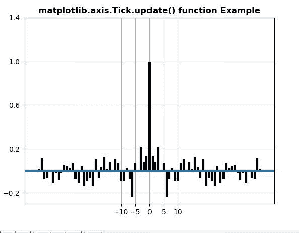
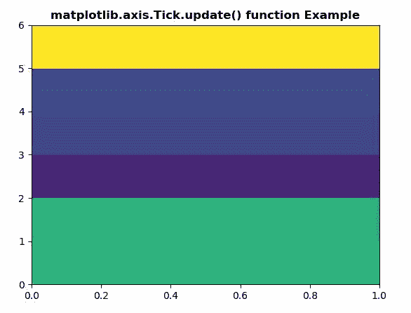

# Python 中的 Matplotlib.axis.Tick.update()函数

> 原文:[https://www . geeksforgeeks . org/matplotlib-axis-tick-update-function-in-python/](https://www.geeksforgeeks.org/matplotlib-axis-tick-update-function-in-python/)

[**Matplotlib**](https://www.geeksforgeeks.org/python-introduction-matplotlib/) 是 Python 中的一个库，是 NumPy 库的数值-数学扩展。这是一个神奇的 Python 可视化库，用于 2D 数组图，并用于处理更广泛的 SciPy 堆栈。

## Matplotlib.axis.Tick.update()函数

matplotlib 库的 axis 模块中的 **Tick.update()函数**用于从字典道具中更新该艺术家的属性。

> **语法:**打勾.更新(自身，道具)
> 
> **参数:**该方法接受以下参数。
> 
> *   **道具:**这个参数是属性的字典。
> 
> **返回值:**此方法不返回值。

以下示例说明 matplotlib.axis.Tick.update()函数在 matplotlib.axis:
**示例 1:**

## 蟒蛇 3

```
# Implementation of matplotlib function
from matplotlib.axis import Tick
import matplotlib.pyplot as plt  
import numpy as np  

np.random.seed(10**7)  
geeks = np.random.randn(100)  

fig, ax = plt.subplots()  
ax.acorr(geeks, usevlines = True,  
         normed = True,  
         maxlags = 40, lw = 3)  

ax.grid(True)  

prop = {'xticks': np.array([-10., -5., 
                            0., 5., 10.]),  
        'yticks': np.array([-0.2,  0.2,  
                            0.6, 1., 1.4]),  
        'ylabel': None, 'xlabel': None}  

Tick.update(ax, prop)

ax.set_title('matplotlib.axis.Tick.update() \
function Example', fontweight ="bold")  

plt.show() 
```

**输出:**



**例 2:**

## 蟒蛇 3

```
# Implementation of matplotlib function
from matplotlib.axis import Tick
import numpy as np   
import matplotlib.pyplot as plt   

xx = np.random.rand(6, 5)   

fig, ax = plt.subplots()   

m = ax.pcolor(xx)   
m.set_zorder(-20)  
prop = {'autoscalex_on': False}  

Tick.update(ax, prop)

ax.set_title('matplotlib.axis.Tick.update() \
function Example', fontweight ="bold")  

plt.show() 
```

**输出:**

