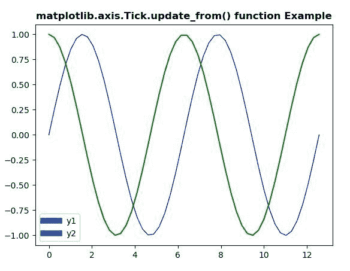
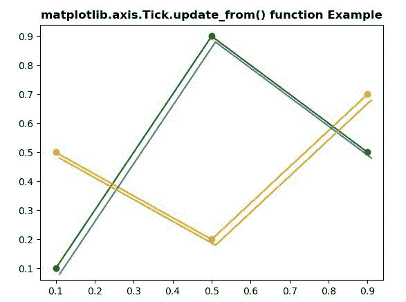

# Python 中 matplotlib . axis . tick . update _ from()函数

> 原文:[https://www . geeksforgeeks . org/matplotlib-axis-tick-update _ from-function-in-python/](https://www.geeksforgeeks.org/matplotlib-axis-tick-update_from-function-in-python/)

[**Matplotlib**](https://www.geeksforgeeks.org/python-introduction-matplotlib/) 是 Python 中的一个库，是 NumPy 库的数值-数学扩展。这是一个神奇的 Python 可视化库，用于 2D 数组图，并用于处理更广泛的 SciPy 堆栈。

## matplotlib . axis . tick . update _ from()函数

matplotlib 库的轴模块中的 **Tick.update_from()函数**用于将属性从他人复制到自己。

> **语法:** Tick.update_from(自身，其他)
> 
> **参数:**该方法接受以下参数。
> 
> *   **其他:**该参数是需要更新的属性。
> 
> **返回值:**此方法不返回值。

以下示例说明 matplotlib . axis . tick . update _ from()函数在 matplotlib.axis:
**示例 1:**

## 蟒蛇 3

```py
# Implementation of matplotlib function
from matplotlib.axis import Tick
import numpy as np 
import matplotlib.pyplot as plt 
from matplotlib.legend_handler import HandlerLine2D 

x = np.linspace(0, 4 * np.pi) 
y1 = np.sin(x) 
y2 = np.cos(x) 

fig = plt.figure() 

ax = fig.add_subplot(111) 
ax.plot(x, y1, c ='b', label ='y1', linewidth = 1.0) 
ax.plot(x, y2, c ='g', label ='y2') 

linewidth = 7

def update(prop1, prop2): 
    Tick.update_from(prop1, prop2) 
    prop1.set_linewidth(7) 

plt.legend(handler_map ={plt.Line2D : HandlerLine2D(update_func = update)}) 

ax.set_title('matplotlib.axis.Tick.update_from() \
function Example', fontweight ="bold")  

plt.show() 
```

**输出:**



**例 2:**

## 蟒蛇 3

```py
# Implementation of matplotlib function
from matplotlib.axis import Tick
import numpy as np 
import matplotlib.pyplot as plt 
from matplotlib.legend_handler import HandlerLine2D
import matplotlib.transforms as mtransforms  

fig, ax = plt.subplots()   
l1, = ax.plot([0.1, 0.5, 0.9],   
              [0.1, 0.9, 0.5],   
              "go-")  
l2, = ax.plot([0.1, 0.5, 0.9],  
              [0.5, 0.2, 0.7],   
              "yo-")  

for l in [l1, l2]:  

    xx = l.get_xdata()  
    yy = l.get_ydata()  

    shadow, = ax.plot(xx, yy)  
    Tick.update_from(shadow, l)  

    ot = mtransforms.offset_copy(l.get_transform(),  
                                 ax.figure,  
                                 x = 4.0,   
                                 y =-6.0,   
                                 units ='points')  

    shadow.set_transform(ot)   
ax.set_title('matplotlib.axis.Tick.update_from() \
function Example', fontweight ="bold")  

plt.show() 
```

**输出:**

