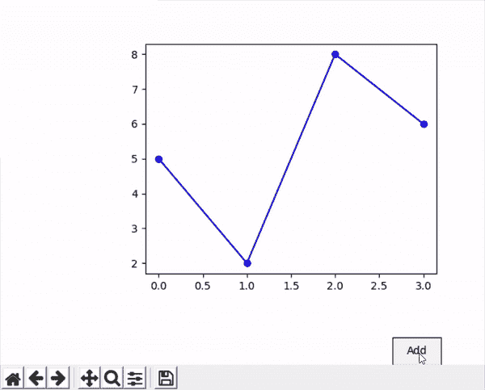

# matplot lib–button widget

> 哎哎哎:# t0]https://www . geeksforgeeks . org/matplot lib-button widget/

在 Matplotlib 中，按钮是我们可以用来执行各种操作的重要部件之一。它们主要用于制作具有不同性质的函数图。有三种按钮

*   纽扣
*   单选按钮
*   检查按钮

在本文中，我们将学习如何在 matplotlib 图中使用不同的按钮。为此，我们将使用一些数据，绘制一个图表，然后形成一个按钮并使用它。让我们借助一些例子来逐一理解按钮。

### **简单按钮**

这是一个简单的按钮，只负责执行一个功能。

> **语法:** simple_button=Button()
> 
> **参数:**
> 
> *   **轴**–定义按钮应该位于的轴
> *   **标签**–按钮上我们想要的名称
> *   **颜色**–按钮的颜色
> *   **悬停颜色**–按钮被点击时的颜色

在这个例子中，我们将创建一个简单的按钮，我们将使用这个按钮向现有的图形中添加一条线。

## 蟒蛇 3

```py
# importing libraries
import numpy as np
import matplotlib.pyplot as plt
from matplotlib.widgets import Button

# creating data
x1=np.array([0,1,2,3])
y1=np.array([5,2,8,6])

# creating plot
fig = plt.figure()
ax = fig.subplots()
plt.subplots_adjust(left = 0.3, bottom = 0.25)
p,=ax.plot(x1,y1,color="blue", marker="o")

# defining function to add line plot
def add(val):
  x2=np.array([0,1,2,3])
  y2=np.array([10,2,0,12])
  ax.plot(x2,y2,color="green", marker="o")

# defining button and add its functionality
axes = plt.axes([0.81, 0.000001, 0.1, 0.075])
bnext = Button(axes, 'Add',color="yellow")
bnext.on_clicked(add)
plt.show()
```

**输出:**



### **单选按钮**

这种类型的按钮由一系列圆形按钮组成，可用于启用/禁用我们的图表的一个功能。

> **语法:**单选按钮=单选按钮()
> 
> **参数:**
> 
> *   **轴**–定义按钮应该位于的轴
> *   **标签**–我们想要的每个按钮的名称列表
> *   **激活**–描述每个按钮状态的布尔列表
> *   **活动颜色**–活动按钮的颜色

这里我们创建了一个简单的正弦图，其中单选按钮显示了图中线条的颜色。

## 蟒蛇 3

```py
import numpy as np
import matplotlib.pyplot as plt
from matplotlib.widgets import RadioButtons

# creating an array starting from
# 0 to 1 with step size 0.01
t = np.arange(0.0, 1.0, 0.01)

# the values of sin values of t
s0 = np.sin(2*np.pi*t)

# depict visualization
fig, ax = plt.subplots()
l, = ax.plot(t, s0, lw=2, color='red')
plt.subplots_adjust(left=0.3)

# adjust radio buttons
axcolor = 'lightgoldenrodyellow'
rax = plt.axes([0.05, 0.4, 0.15, 0.30],
               facecolor=axcolor)

radio = RadioButtons(rax, ['red', 'blue', 'green'],
                     [True,False,False,False],
                     activecolor='r')

def color(labels):
    l.set_color(labels)
    fig.canvas.draw()
radio.on_clicked(color)

plt.show()
```