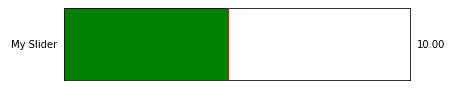
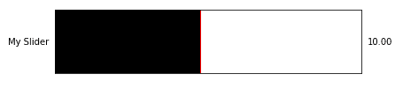
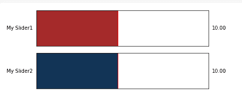

# Matplotlib–更改滑块颜色

> 原文:[https://www . geesforgeks . org/matplotlib-change-slider-color/](https://www.geeksforgeeks.org/matplotlib-change-slider-color/)

在本文中，我们将看到如何在 Matplotlib 中更改绘图的滑块颜色。首先，让我们了解什么是滑块小部件。 **matplotlib** 中的**滑块**小部件用于创建滚动滑块，我们可以在 python 程序中使用滚动滑块的值进行更改。默认情况下，滑块的颜色是蓝色，因此，我们将学习更改滑块的颜色。

> **语法:**滑块(尺寸、名称、最小值、最大值、初始值、**颜色**；
> 
> **参数:**
> 
> *   **尺寸**:该参数取 plt.axes()对象来确定滑块的尺寸
> *   **名称**:滑块名称
> *   **最小值**:滑块的最小可能值
> *   **最大值**:滑块的最大可能值
> *   **初始值**:滑块的初始值
> *   **颜色**:滑块填充的颜色

### **安装**

Windows、Linux 和 macOS 发行版都将 matplotlib 及其大部分依赖项作为轮包。运行以下命令安装 matplotlib 包:

```
python -mpip install -U matplotlib
```

**注:** Slider 有很多参数。我们对颜色的争论感兴趣。

**例 1:**

使用颜色名称，我们修改滑块的颜色。有‘红’、‘蓝’、‘绿’、‘黄’、‘棕’等……颜色名称可选。

## 计算机编程语言

```
# import libraries
import matplotlib.pyplot as plt
from matplotlib.widgets import Slider

# define dimensions
width = 0.8
height = 0.25
minValue = 1
maxValue = 20

# Create dimensions of slider
dimentions_of_slider = plt.axes([0, 0, width, height])

# Create slider
mySlider = Slider(dimentions_of_slider, 'My Slider',
                  minValue, maxValue, valinit=10,
                  color='green')

# Show Graph
plt.show()
```

**输出:**



**例 2:**

这个例子类似于上面的例子，但是我们使用十六进制代码来定义颜色。当我们需要我们想要的准确颜色时，我们使用**十六进制颜色代码。**

## 计算机编程语言

```
# import libraries
import matplotlib.pyplot as plt
from matplotlib.widgets import Slider

# define dimensions
width = 0.8
height = 0.25
minValue = 1
maxValue = 20

# Create dimensions of slider
dimentions_of_slider = plt.axes([0, 0, width, height])

# Create slider
# Notice the HEX color code below
mySlider = Slider(dimentions_of_slider, 'My Slider',
                  minValue, maxValue, valinit=10,
                  color='#000000')

# Show Graph
plt.show()
```

**输出:**



**例 3:**

在这个例子中，我们使用不同的格式创建了多个不同颜色的滑块来提及颜色。

## 计算机编程语言

```
# import libraries
import matplotlib.pyplot as plt
from matplotlib.widgets import Slider

# define dimensions
width = 0.8
height = 0.25
minValue = 1
maxValue = 20

# define sliders
dimentions_of_slider1 = plt.axes([0, 0.3, width, height])
dimentions_of_slider2 = plt.axes([0, 0, width, height])

# Using name of Color
mySlider1 = Slider(dimentions_of_slider1, 'My Slider1',
                   minValue, maxValue, valinit=10,
                   color='brown')

# Using HEX Code of Color
mySlider2 = Slider(dimentions_of_slider2, 'My Slider2',
                   minValue, maxValue, valinit=10,
                   color='#123456')

# show the plot
plt.show()
```

**输出:**

