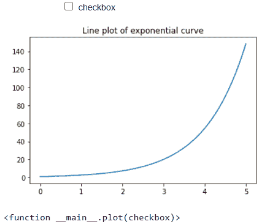
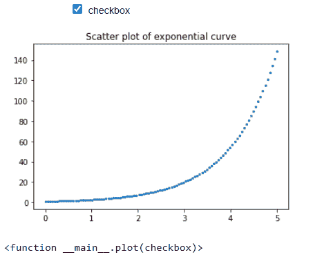

# matplotlib–checkbox widget

> 哎哎哎:# t0]https://www . geeksforgeeks . org/matplot lib checkbox widget/

在本文中，我们将看到这些复选框在 [matplotlib](https://www.geeksforgeeks.org/python-introduction-matplotlib/) 剧情中的使用，以使我们的剧情更具互动性。Checkbox 小部件为我们提供了让情节更具互动性的自由。通过使用复选框，我们可以执行勾选事件，勾选复选框将触发一些事件。

我们将使用**ipywidget**库中的**interaction()**功能来创建复选框。交互功能自动创建用户界面控件，用于交互浏览代码和数据。它接受两个参数；一个自定义函数和一个布尔关键字参数，使用它们为复选框生成自动生成的用户界面控件。

**进场:**

我们将绘制(0，5)范围内的指数曲线。为此，我们在 0-5 范围内创建了一百个点(x 值)，然后使用 NumPy.exp()函数生成其相应的指数值。如前所述，现在创建了一个名为 plot()的自定义函数，该函数接受在 interact()函数中传递的布尔值。根据布尔值“真”或“假”，复选框被触发。

当传递的参数设置为假时，默认情况下不会单击该复选框，将显示指数曲线的简单线图。当传递的参数设置为真时，单击复选框，显示指数曲线的散点图。

**代码:**

## 计算机编程语言

```
import numpy as np
import matplotlib.pyplot as plt
from ipywidgets import interact
%matplotlib inline

x = np.linspace(0, 5, 100)
y = np.exp(x)

# Plotting the graph for exponential function
def plot(checkbox):

    # if checkbox is ticked then scatter
    # plot will be displayed
    if checkbox:
        plt.scatter(x, y, s = 5)
        plt.title('Scatter plot of exponential curve')

    # if checkbox is not ticked (by default)
    # line plot will be displayed
    else:
        plt.plot(x, y)
        plt.title('Line plot of exponential curve')

# calling the interact function        
interact(plot, checkbox = bool())
```

**输出:**

默认情况下，未单击复选框时，布尔值设置为假，将显示线条图。



未勾选复选框:线形图

勾选复选框后，交互()函数中的布尔值被设置为真，并且将显示散点图。



勾选复选框:散点图