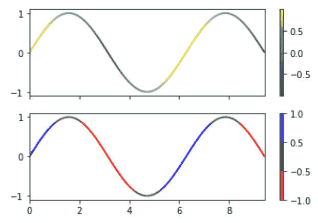
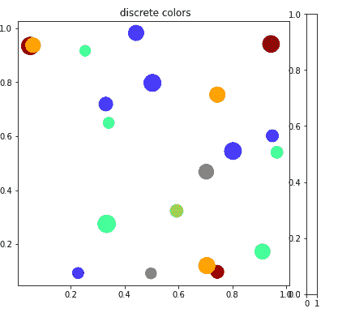

# Python 中的 Matplotlib.colors.BoundaryNorm 类

> 原文:[https://www . geeksforgeeks . org/matplotlib-colors-boundarynorm-python 中的类/](https://www.geeksforgeeks.org/matplotlib-colors-boundarynorm-class-in-python/)

[**Matplotlib**](http://geeksforgeeks.org/python-matplotlib-an-overview/) 是 Python 中一个惊人的可视化库，用于数组的 2D 图。Matplotlib 是一个多平台数据可视化库，构建在 NumPy 数组上，旨在与更广泛的 SciPy 堆栈一起工作。

## matplotlib.colors.BoundaryNorm

**matplotlib . colors . boundarynorm**类属于 **matplotlib.colors** 模块。matplotlib.colors 模块用于将颜色或数字参数转换为 RGBA 或 RGB。该模块用于将数字映射到颜色，或者在一维颜色数组(也称为颜色映射)中进行颜色规格转换。
matplotlib . colors . boundarynorm 类用于创建基于离散间隔的颜色图。BoundaryNorm 将值映射为整数，不像 Normalize 或 LogNorm 那样映射为 0 到 1 的区间。分段线性插值可用于映射到 o-区间，但是，使用整数更简单，并且减少了整数和浮点之间的来回转换次数。
**参数** :

1.  **边界**:是一个数组状的物体，单调增加边界的顺序

2.  **ncolor** :它接受一个整数值，代表将要使用的颜色映射中的颜色数量。

3.  **clip** :接受布尔值，为可选参数。如果剪辑为“真”，则超出范围且低于边界[0]的值将被映射为 0，而高于边界[-1]的值将被映射为 ncolors。如果片段设置为“假”，超出范围的值以及它们在边界[0]之下的值将被映射到-1，而如果它们在边界[-1]之上，它们将被映射到 ncolors。彩色地图。__call__()将这些转换为有效的索引。

**注意:**面元的边缘由边界定义，并且落入面元内的数据被映射到相同的颜色索引。如果 ncolor 不等于箱数，则使用线性插值为它们选择颜色。
**例 1:**

## 蟒蛇 3

```
import numpy as np
import matplotlib.pyplot as plt
from matplotlib.collections import LineCollection
from matplotlib.colors import ListedColormap, BoundaryNorm

a = np.linspace(0, 3 * np.pi, 500)
b = np.sin(a)
# this is the first derivative
dbda = np.cos(0.5 * (a[:-1] + a[1:])) 

# Creating  line segments so
# to color them individually
points = np.array([a, b]).T.reshape(-1, 1, 2)
set_of_segments = np.concatenate([points[:-1],
                                  points[1:]],
                                 axis = 1)

figure, axes = plt.subplots(2, 1,
                            sharex = True,
                            sharey = True)

# Mapping the data points with
# continuous norm
continuous_norm = plt.Normalize(dbda.min(),
                               dbda.max())

line_collection = LineCollection(set_of_segments,
                                 cmap ='viridis',
                                 norm = continuous_norm)

# Set the values used for
# colormapping
line_collection.set_array(dbda)
line_collection.set_linewidth(2)
line = axes[0].add_collection(line_collection)
figure.colorbar(line, ax = axes[0])

# Use a boundary norm instead
cmap = ListedColormap(['r', 'g', 'b'])
boundary_norm = BoundaryNorm([-1, -0.5, 0.5, 1],
                             cmap.N)

line_collection = LineCollection(set_of_segments,
                                 cmap = cmap,
                                 norm = boundary_norm)

line_collection.set_array(dbda)
line_collection.set_linewidth(2)
line = axes[1].add_collection(line_collection)
figure.colorbar(line, ax = axes[1])

axes[0].set_xlim(a.min(), a.max())
axes[0].set_ylim(-1.1, 1.1)
plt.show()
```

**输出:**



**例 2:**

## 蟒蛇 3

```
import numpy as np
import matplotlib as mpl
import matplotlib.pylab as plt

# setup the plot
figure, axes = plt.subplots(1, 1,
                            figsize=(6, 6))

# defining random data
x = np.random.rand(20)
y = np.random.rand(20) 
tag = np.random.randint(0, 20, 20)
tag[10:12] = 0

# defining the colormap
cmap = plt.cm.jet 

# extracting all colors
cmaplist = [cmap(i) for i in range(cmap.N)]

# making first color entry  grey
cmaplist[0] = (.5, .5, .5, 1.0)

# new map
cmap = mpl.colors.LinearSegmentedColormap.from_list(
   'Custom cmap', cmaplist, cmap.N)

# defining the bins and norms
bounds = np.linspace(0, 20, 21)
norm = mpl.colors.BoundaryNorm(bounds,
                               cmap.N)

# the scatter
scat = axes.scatter(x, y, c=tag,
                    s=np.random.randint(100,
                                        500,
                                        20),
                    cmap=cmap, norm=norm)

# axes for the colorbar
ax2 = figure.add_axes([0.95, 0.1,
                       0.03, 0.8])

axes.set_title(' discrete colors')
```

**输出** :

