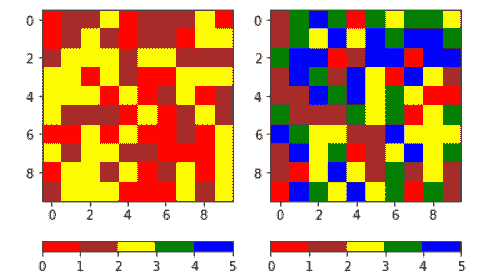
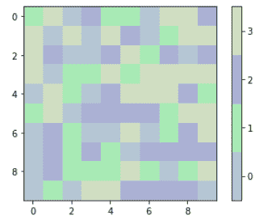

# Python 中的 matplotlib . colors . from _ levels _ 和 _colors()

> 原文:[https://www . geeksforgeeks . org/matplotlib-colors-from _ levels _ and _ colors-in-python/](https://www.geeksforgeeks.org/matplotlib-colors-from_levels_and_colors-in-python/)

[**Matplotlib**](http://geeksforgeeks.org/python-matplotlib-an-overview/) 是 Python 中一个惊人的可视化库，用于数组的 2D 图。Matplotlib 是一个多平台数据可视化库，构建在 NumPy 数组上，旨在与更广泛的 SciPy 堆栈一起工作。

## matplotlib . colors . from _ levels _ and _ colors()

`matplotlib.colors.from_levels_and_colors()`函数是一个辅助函数，帮助创建 cmap 和 norm 实例，其行为类似于 contourf 的 levels 和 colors 参数。

> **语法:**matplotlib . colors . from _ levels _ 和 _colors(levels，colors，extend = ' none ')
> 
> **参数:**
> 
> 1.  **级别:**这是一个表示量化级别的数字序列，用于构建边界范数。如果 lev[k] < = v < lev[k+1]，则值 v 被量化为等级 k。
> 2.  **颜色:**它是一个颜色序列，用作每个级别的填充颜色。如果 extend 为“none ”,则必须有 n _ level–1 种颜色。为“最小”或“最大”扩展添加一种额外的颜色，为“两者”扩展添加两种颜色。
> 3.  **extend:** 它是一个可选参数，接受四个值中的一个，即“one”、“min”、“max”或“both”。
> 
> **返回类型:**该函数返回一个归一化 cmap 和一个色图范数

**例 1:**

```py
import numpy as np
import matplotlib.pyplot as plt
import matplotlib.colors

data1 = 3 * np.random.random((10, 10))
data2 = 5 * np.random.random((10, 10))

levels = [0, 1, 2, 3, 4, 5]
colors = ['red', 'brown',
          'yellow', 'green',
          'blue']
cmap, norm = matplotlib.colors.from_levels_and_colors(levels, 
                                                      colors)

fig, axes = plt.subplots(ncols = 2)

for ax, dat in zip(axes, [data1, data2]):
    im = ax.imshow(dat, 
                   cmap = cmap,
                   norm = norm, 
                   interpolation ='none')

    fig.colorbar(im, ax = ax, orientation ='horizontal')

plt.show()
```

**输出:**


**例 2:**

```py
import numpy as np
import matplotlib.pyplot as plt
from matplotlib.colors import from_levels_and_colors

nvals = np.random.randint(2, 20)
data = np.random.randint(0, nvals, 
                         (10, 10))

colors = np.random.random((nvals, 3))
# Make the colors pastels...
colors = colors / 2.5 + 0.55

levels = np.arange(nvals + 1) - 0.5
cmap, norm = from_levels_and_colors(levels,
                                    colors)

fig, ax = plt.subplots()
im = ax.imshow(data,
               interpolation ='nearest', 
               cmap = cmap, 
               norm = norm)

fig.colorbar(im, ticks = np.arange(nvals))
plt.show()
```

**输出:**
