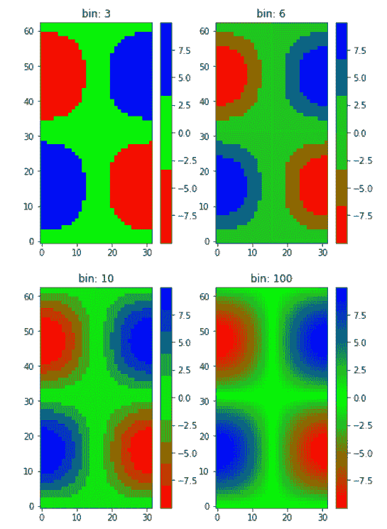

# Python 中的 matplotlib . colors . linearsegmented color map 类

> 原文:[https://www . geesforgeks . org/matplotlib-colors-linear segmented color map-python 中的类/](https://www.geeksforgeeks.org/matplotlib-colors-linearsegmentedcolormap-class-in-python/)

[**Matplotlib**](http://geeksforgeeks.org/python-matplotlib-an-overview/) 是 Python 中一个惊人的可视化库，用于数组的 2D 图。Matplotlib 是一个多平台数据可视化库，构建在 NumPy 数组上，旨在与更广泛的 SciPy 堆栈一起工作。

## matplot lib . colors . linear segmentdcolarmap

**matplotlib . colors . linearsegmented colarmap**类属于 **matplotlib.colors** 模块。matplotlib.colors 模块用于将颜色或数字参数转换为 RGBA 或 RGB。该模块用于将数字映射到颜色，或者在一维颜色数组(也称为颜色映射)中进行颜色规格转换。
matplotlib . colors . linearsegmented color map 类用于在线性线段的帮助下，基于查找表对对象进行颜色映射。当 0-1 域将每个原色分成任意数量的段时，通过线性插值生成查找表。它还可以用于从线性映射线段创建颜色映射。一个名为段数据的字典由红色、蓝色和绿色条目组成。每个条目都需要是 x，y0，y1 元组的列表，从而创建表的行。需要注意的是，alpha 条目是可选的。
例如，假设您希望红色从 0 增加到 1，绿色做同样的事情，但是在中间的一半，蓝色在上面的一半。那么你可以使用下面的字典:

> seg_data_dict =
> { '红色':[(0.0，0.0，0.0)，
> (0.5，1.0，1.0)，
> (1.0，1.0，1.0)]，
> '绿色':[(0.0，0.0，0.0)，
> (0.25，0.0，0.0)，
> (0.75，1.0，1.0)，
> (1.0，1.0

表中给定颜色的每一行都是元组 x，y0，y1 的序列。在每个序列中，x 必须从 0 到 1 单调递增。对于落在 x[i]和 x[i+1]之间的所有输入值 z，给定颜色的线性插值输出值在 y1[i]和 y0[i+1]之间:

> 第 I 行:x y0 y1
> 第 i+1 行:x y0 y1

因此，从不使用第一行的 y0 和最后一行的 y1。
**方法类:**

1.  **静态 from_list(名称，颜色，N=256，gamma=1.0):** 此方法用于创建一个线性分段颜色映射，其名称来自一系列颜色，这些颜色从 val=0 时的颜色[0]均匀移动到 val=1 时的颜色[-1]。n 表示 rgb 量化级别的数量。此外，元组列表(值、颜色)会在范围内产生不均匀的划分。

2.  **反转(自身，名称=无):**用于制作色彩映射的反转实例。
    T3】参数:
    *   **名称:**它是一个可选参数，接受字符串形式的反转颜色映射的名称。如果没有，该名称将设置为父 color map+“r”的名称。
        **返回:**这个方法返回一个反转的颜色图。

3.  **set_gamma(self，gamma):** 用于通过设置新的 gamma 值
    来重新生成颜色图

**例 1:**

## 蟒蛇 3

```py
import numpy as np
import matplotlib.pyplot as plt
from matplotlib.colors import LinearSegmentedColormap

# some dummy data
a = np.arange(0, np.pi, 0.1)
b = np.arange(0, 2 * np.pi, 0.1)
A, B = np.meshgrid(a, b)
X = np.cos(A) * np.sin(B) * 10

# custom segmented color dictionary

cdict1 = {'red':   ((0.0, 0.0, 0.0),
                   (0.5, 0.0, 0.1),
                   (1.0, 1.0, 1.0)),

         'green': ((0.0, 0.0, 0.0),
                   (1.0, 0.0, 0.0)),

         'blue':  ((0.0, 0.0, 1.0),
                   (0.5, 0.1, 0.0),
                   (1.0, 0.0, 0.0))
        }

cdict2 = {'red':   ((0.0, 0.0, 0.0),
                   (0.5, 0.0, 1.0),
                   (1.0, 0.1, 1.0)),

         'green': ((0.0, 0.0, 0.0),
                   (1.0, 0.0, 0.0)),

         'blue':  ((0.0, 0.0, 0.1),
                   (0.5, 1.0, 0.0),
                   (1.0, 0.0, 0.0))
        }

cdict3 = {'red':  ((0.0, 0.0, 0.0),
                   (0.25, 0.0, 0.0),
                   (0.5, 0.8, 1.0),
                   (0.75, 1.0, 1.0),
                   (1.0, 0.4, 1.0)),

         'green': ((0.0, 0.0, 0.0),
                   (0.25, 0.0, 0.0),
                   (0.5, 0.9, 0.9),
                   (0.75, 0.0, 0.0),
                   (1.0, 0.0, 0.0)),

         'blue':  ((0.0, 0.0, 0.4),
                   (0.25, 1.0, 1.0),
                   (0.5, 1.0, 0.8),
                   (0.75, 0.0, 0.0),
                   (1.0, 0.0, 0.0))
        }

# Creating a modified version of cdict3
# with some transparency
# in the center of the range.
cdict4 = {**cdict3,
          'alpha': ((0.0, 1.0, 1.0),
                #   (0.25, 1.0, 1.0),
                    (0.5, 0.3, 0.3),
                #   (0.75, 1.0, 1.0),
                    (1.0, 1.0, 1.0)),
          }
blue_red1 = LinearSegmentedColormap('BlueRed1',
                                    cdict1)
blue_red2 = LinearSegmentedColormap('BlueRed2',
                                    cdict2)
plt.register_cmap(cmap = blue_red2)

# optional lut kwarg
plt.register_cmap(name ='BlueRed3',
                  data = cdict3)
plt.register_cmap(name ='BlueRedAlpha',
                  data = cdict4)
figure, axes = plt.subplots(2, 2,
                            figsize =(6, 9))

figure.subplots_adjust(left = 0.02,
                       bottom = 0.06,
                       right = 0.95,
                       top = 0.94,
                       wspace = 0.05)

# Making 4 different subplots:
img1 = axes[0, 0].imshow(X,
                         interpolation ='nearest',
                         cmap = blue_red1)

figure.colorbar(img1, ax = axes[0, 0])

cmap = plt.get_cmap('BlueRed2')
img2 = axes[1, 0].imshow(X,
                         interpolation ='nearest',
                         cmap = cmap)

figure.colorbar(img2, ax = axes[1, 0])

# set the third cmap as the default.
plt.rcParams['image.cmap'] = 'BlueRed3'

img3 = axes[0, 1].imshow(X,
                         interpolation ='nearest')
figure.colorbar(img3, ax = axes[0, 1])
axes[0, 1].set_title("1st Alpha")

# Draw a line with low zorder to
# keep it behind the image.
axes[1, 1].plot([0, 10 * np.pi],
                [0, 20 * np.pi],
                color ='c',
                lw = 19,
                zorder =-1)

img4 = axes[1, 1].imshow(X,
                         interpolation ='nearest')
figure.colorbar(img4, ax = axes[1, 1])

# Here it is: changing the colormap
# for the current image and its
# colorbar after they have been plotted.
img4.set_cmap('BlueRedAlpha')
axes[1, 1].set_title("Variation in alpha")

figure.subplots_adjust(top = 0.8)

plt.show()
```

**输出:**


**例 2:**

## 蟒蛇 3

```py
import numpy as np
import matplotlib.pyplot as plt
from matplotlib.colors import LinearSegmentedColormap

# Make some illustrative fake data:
a = np.arange(0, np.pi, 0.1)
b = np.arange(0, 2 * np.pi, 0.1)
A, B = np.meshgrid(a, b)
X = np.cos(A) * np.sin(B) * 10

# colormap froma list
# R -> G -> B
list_colors = [(1, 0, 0),
               (0, 1, 0),
               (0, 0, 1)] 

# Discretizes the interpolation
# into bins
all_bins = [3, 6, 10, 100]
cmap_name = 'my_list'
figure, axes = plt.subplots(2, 2,
                            figsize =(6, 9))

figure.subplots_adjust(left = 0.02,
                       bottom = 0.06,
                       right = 0.95,
                       top = 0.94,
                       wspace = 0.05)

for all_bin, ax in zip(all_bins, axes.ravel()):

    # Making the the colormap
    cm = LinearSegmentedColormap.from_list(
        cmap_name,
        list_colors,
        N = all_bin)

    im = ax.imshow(X, interpolation ='nearest',
                   origin ='lower', cmap = cm)

    ax.set_title("bin: % s" % all_bin)
    fig.colorbar(im, ax = ax)
```

**输出:**

