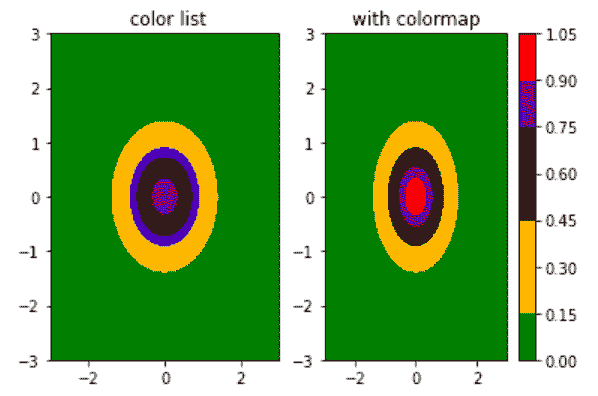

# Python 中的 matplotlib . colors . listed color map 类

> 原文:[https://www . geesforgeks . org/matplotlib-colors-listed color map-python 中的类/](https://www.geeksforgeeks.org/matplotlib-colors-listedcolormap-class-in-python/)

[**Matplotlib**](http://geeksforgeeks.org/python-matplotlib-an-overview/) 是 Python 中一个惊人的可视化库，用于数组的 2D 图。Matplotlib 是一个多平台数据可视化库，构建在 NumPy 数组上，旨在与更广泛的 SciPy 堆栈一起工作。

## matplot lib . colors . listdcolormap

**matplotlib . colors . listed color map**类属于 **matplotlib.colors** 模块。matplotlib.colors 模块用于将颜色或数字参数转换为 RGBA 或 RGB。该模块用于将数字映射到颜色，或者在一维颜色数组(也称为颜色映射)中进行颜色规格转换。

matplotlib . colors . listed color map 类用于从颜色列表中创建 colarmap 对象。这对于直接索引到 colormap 非常有用，也可以用于为普通映射创建特殊的 color map。

> **语法:**class matplotlib . colors . listed color map(colors，name='from_list '，N=None)
> 
> **参数:**
> 
> *   **颜色:**它是 Matplotlib 颜色规格的数组或列表，或等同于 N×3 或 N×4 浮点数组(N 个 rgb 或 rgba 值)
> *   **名称:**它是一个可选参数，接受一个字符串来标识颜色映射。
> *   **N:** 它是一个可选参数，接受代表地图中条目数量的整数值。它的默认值是无，其中颜色列表中的每个元素都有一个颜色映射条目。如果 N 小于 len(颜色)，列表将在 N 处截断，而如果 N 大于，列表将重复扩展。

**类的方法:**
**1) reversed():** 这用于创建颜色映射的反向实例。

> **语法:**反转(自身，名称=无)
> 
> **参数:**
> 
> *   **名称:**这是一个可选参数，表示反转颜色映射的名称。如果设置为无，该名称将是父 colormap + "_r "的名称。
> 
> **返回:**返回一个颜色映射的反向实例

**例 1:**

```py
import matplotlib.pyplot as plt
import numpy as np
import matplotlib.colors

a = np.linspace(-3, 3)
A, B = np.meshgrid(a, a)
X = np.exp(-(A**2 + B**2))
figure, (axes1, axes2) = plt.subplots(ncols = 2)

colors =["green", "orange", 
         "gold", "blue", "k", 
        "#550011", "purple",
         "red"]

axes1.set_title(" color list")
contour = axes1.contourf(A, B, X, 
                         colors = colors)

axes2.set_title("with colormap")
cmap = matplotlib.colors.ListedColormap(colors)
contour = axes2.contourf(A, B, X, cmap = cmap)
figure.colorbar(contour)

plt.show()
```

**输出:**


**例 2:**

```py
import matplotlib.pyplot as plt
import numpy as np
import matplotlib.colors as colors
from mpl_toolkits.axes_grid1 import make_axes_locatable

res = np.array([[0, 2], [3, 4]], dtype = int)

u = np.unique(res)
bounds = np.concatenate(([res.min()-1],
                         u[:-1]+np.diff(u)/2.,
                         [res.max()+1]))

norm = colors.BoundaryNorm(bounds, len(bounds)-1)
color_map1 = ['#7fc97f', '#ffff99',
              '#386cb0', '#f0027f']
color_map = colors.ListedColormap(color_map1) 

fig, axes = plt.subplots()
img = axes.imshow(res, cmap = color_map,
                  norm = norm)
divider = make_axes_locatable(axes)
cax = divider.append_axes("right", size ="5 %")

color_bar = plt.colorbar(img, cmap = color_map, 
                         norm = norm, cax = cax)

color_bar.set_ticks(bounds[:-1]+np.diff(bounds)/2.)
color_bar.ax.set_yticklabels(color_map1)
color_bar.ax.tick_params(labelsize = 10)

plt.show()
```

**输出:**
