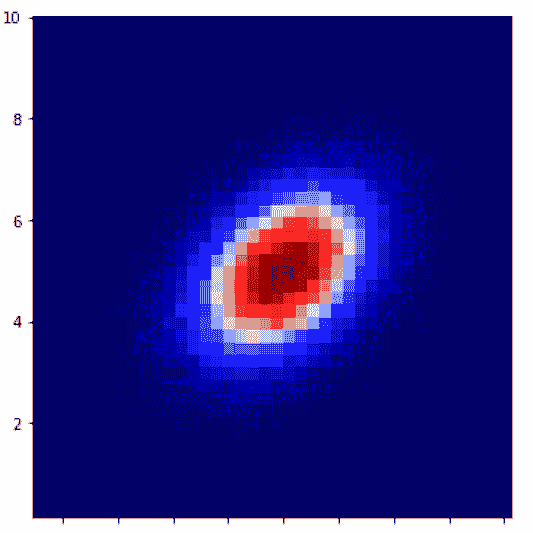
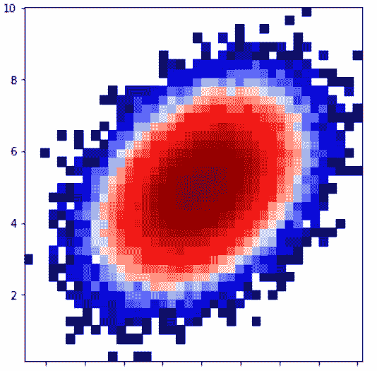
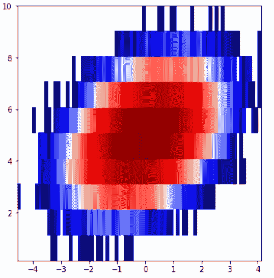
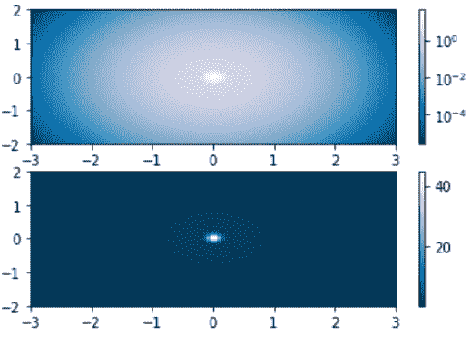

# Python 中的 Matplotlib.colors.LogNorm 类

> 原文:[https://www . geesforgeks . org/matplotlib-colors-log norm-in-class-python/](https://www.geeksforgeeks.org/matplotlib-colors-lognorm-class-in-python/)

[**Matplotlib**](http://geeksforgeeks.org/python-matplotlib-an-overview/) 是 Python 中一个惊人的可视化库，用于数组的 2D 图。Matplotlib 是一个多平台数据可视化库，构建在 NumPy 数组上，旨在与更广泛的 SciPy 堆栈一起工作。

## matplotlib.colors.LogNorm()

**matplotlib . colors . lognorm()**类属于 **matplotlib.colors** 模块。matplotlib.colors 模块用于将颜色或数字参数转换为 RGBA 或 RGB。该模块用于将数字映射到颜色，或者在一维颜色数组(也称为颜色映射)中进行颜色规格转换。

matplotlib.colors.LogNorm 类用于在对数标度上将一个值归一化到 0-1 的范围。如果未设置 vmax 或 vmin，则分别从处理的第一个输入的最大值和最小值开始初始化。这意味着`__call__(A)`调用自动缩放 _ 无(A)。如果剪辑设置为“真”，并且给定的值超出范围，则返回的值为 0 或 1，以最接近的值为准。如果 vmin==vmax，则返回 0。它适用于数组或标量，也包括屏蔽数组。如果剪辑设置为“真”，则屏蔽值将设置为“否则它们将保持屏蔽状态”。剪辑的默认值设置为“假”。

**该类方法:**

1.  **自动缩放(self，A):** 用于将 vmax、vmin 分别设置为 A 的最大值和最小值。
2.  **自动缩放 _None(self，A):** 仅用于自动缩放无值的 vmin 或 vmax。
3.  **反转(自身，值)**:返回颜色映射的反转值。

**例 1:**

```py
import matplotlib.pyplot as plt
import numpy as np
from matplotlib import colors
from matplotlib.ticker import PercentFormatter

# Setting random state for 
# reproducibility
np.random.seed(19680801)

max_points = 100000
all_bins = 20

# Generate a normal distribution, 
# center at x = 0 and y = 5
a = np.random.randn(max_points)
b = .4 * a + np.random.randn(100000) + 5

figure, axes = plt.subplots(3, 1,
                            figsize =(5, 15),
                            sharex = True, 
                            sharey = True,
                            tight_layout = True)

# Incrementing the number of 
# bins on each axis
axes[0].hist2d(a, b, bins = 40)

# Defining normalization of 
# the colors
axes[1].hist2d(a, b, bins = 40,
               norm = colors.LogNorm())

# defining custom numbers of bins 
# for each axis
axes[2].hist2d(a, b, bins =(80, 10),
               norm = colors.LogNorm())

plt.show()
```

 **输出:**

 

**例 2:**

```py
import matplotlib.pyplot as plt
import numpy as np
from matplotlib.colors import LogNorm

N = 100
A, B = np.mgrid[-3:3:complex(0, N),
                -2:2:complex(0, N)]

X1 = np.exp(-(A)**2 - (B)**2)
X2 = np.exp(-(A * 10)**2 - (B * 10)**2)
X = X1 + 50 * X2

figure, (axes0, axes1) = plt.subplots(2, 1)

P = axes0.pcolor(A, B, X,
               norm = LogNorm(vmin = X.min(),
                              vmax = X.max()),
                 cmap ='PuBu_r')

figure.colorbar(P, ax = axes0)

P = axes1.pcolor(A, B, X,
                 cmap ='PuBu_r')

figure.colorbar(P, ax = axes1)

plt.show()
```

**输出:**
