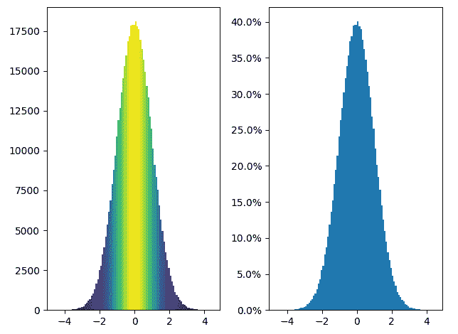
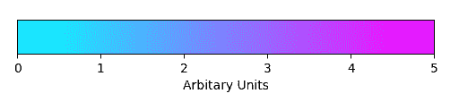

# Python 中的 Matplotlib.colors.Normalize 类

> 原文:[https://www . geesforgeks . org/matplotlib-colors-normalize-python 中的类/](https://www.geeksforgeeks.org/matplotlib-colors-normalize-class-in-python/)

[**Matplotlib**](http://geeksforgeeks.org/python-matplotlib-an-overview/) 是 Python 中一个惊人的可视化库，用于数组的 2D 图。Matplotlib 是一个多平台数据可视化库，构建在 NumPy 数组上，旨在与更广泛的 SciPy 堆栈一起工作。

## matplotlib . colors . normalize(正常)

**matplotlib . colors . normalize**类属于 **matplotlib.colors** 模块。matplotlib.colors 模块用于将颜色或数字参数转换为 RGBA 或 RGB。该模块用于将数字映射到颜色，或者在一维颜色数组(也称为颜色映射)中进行颜色规格转换。
matplotlib . colors . normalize 类用于将数据规范化为[0.0，1.0]的区间。
**语法:**

> 类 matplotlib . colors . normalize(vmin =无，vmax =无，clip=False)

如果未设置 vmin 或 vmax，则分别从处理的第一个输入的最小值和最大值开始初始化。换句话说，__call__(数据)调用 autoscale_None(数据)。如果剪辑的值设置为真，并且给定值超出范围，则它返回 0 或 1，取最接近的值。如果 vmax==vmin，则返回 0。它既可以处理标量数组，也可以处理包含屏蔽数组的数组。如果剪辑为“真”，屏蔽值将设置为 1，否则它们将保持屏蔽状态。
**方法:**

1.  **自动缩放(自身，A):** 该方法将 vmin 设置为最小值，将 vmax 设置为最大值

2.  **自动缩放 _None(self，A):** 此方法仅自动缩放值为 None 的 vmin 和 vmax。

3.  **反转(自身，值):**它交换 vmin 和 vmax 的值。

4.  **静态 process_value(值):**该方法中的 value 参数可以是标量，也可以是序列。它用于使输入值均匀化，以实现高效简单的标准化。此方法返回匹配值的掩码数组。所有浮点数据类型都被保留，具有两个或两个以下字节的整数数据类型被转换为 np.float32，而较大的字节类型被转换为 np.float64。这样做是为了通过使用就地操作尽可能保留 float32 值来提高较大数组的速度。

5.  **scaled(self):** 它返回一个布尔值来检查是否设置了 vmin 或 vmax。

**例 1:**

## 蟒蛇 3

```py
import matplotlib.pyplot as plt
import numpy as np
from matplotlib import colors
from matplotlib.ticker import PercentFormatter

# set a  random state for
# reproducibility
np.random.seed(19687581)

total_points = 500000
total_bins = 100

# Centering at a = 0 and b = 5
# generate normal distributions
a = np.random.randn(total_points)
b = .4 * a + np.random.randn(500000) + 5

figure, axes = plt.subplots(1, 2,
                            tight_layout = True)

# C is the count in each bin
C, bins, patches = axes[0].hist(a,
                                bins = total_bins)

# We'll color code by height,
# but you could use any scalar
fracs = C / C.max()

# Normalize of  the data to 0..1
# for covering the full range of
# the colormap
norm = colors.Normalize(fracs.min(), fracs.max())

# looping through the objects and
# setting the color of each accordingly
for thisfrac, thispatch in zip(fracs, patches):
    color = plt.cm.viridis(norm(thisfrac))
    thispatch.set_facecolor(color)

# normalize the inputs by C
axes[1].hist(a, bins = total_bins, density = True)

# formating the y-axis for displaying
# percentage
axes[1].yaxis.set_major_formatter(PercentFormatter(xmax = 1))
```

**输出:**



**例 2:**

## 蟒蛇 3

```py
import matplotlib.pyplot as plt
import matplotlib as mpl

figure, axes = plt.subplots(figsize =(6, 1))
figure.subplots_adjust(bottom = 0.5)

color_map = mpl.cm.cool
normalizer = mpl.colors.Normalize(vmin = 0, vmax = 5)

figure.colorbar(mpl.cm.ScalarMappable(norm = normalizer,
               cmap = color_map),
               cax = axes, orientation ='horizontal',
               label ='Arbitrary Units')
```

**输出:**

