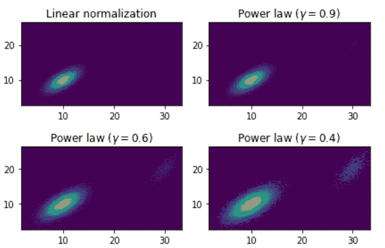
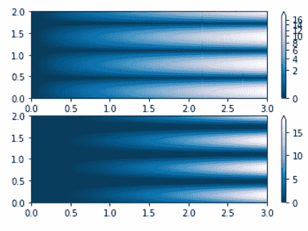

# Python 中的 Matplotlib.colors.PowerNorm 类

> 原文:[https://www . geesforgeks . org/matplotlib-colors-power norm-python 中的类/](https://www.geeksforgeeks.org/matplotlib-colors-powernorm-class-in-python/)

[**Matplotlib**](http://geeksforgeeks.org/python-matplotlib-an-overview/) 是 Python 中一个惊人的可视化库，用于数组的 2D 图。Matplotlib 绘图库是一个基于 NumPy 阵列的多平台数据可视化库，旨在与更广泛的 SciPy 堆栈协同工作。

## matplotlib.colors.PowerNor

**matplotlib . colors . power norm**类属于 **matplotlib.colors** 模块。matplotlib.colors 模块用于将颜色或数字参数转换为 RGBA 或 RGB。该模块用于将数字映射到颜色，或者在一维颜色数组(也称为颜色映射)中进行颜色规格转换。
matplotlib . colors . powernorm 类用于将值线性映射到–的范围，然后在该范围内应用幂律归一化。它的基类是 matplotlib . colors . normalize .
**类的方法:**

*   **反转(自身，值):**此方法返回色彩映射的反转值。

**例 1:**

## 蟒蛇 3

```py
import matplotlib.pyplot as plt
import matplotlib.colors as mcolors
import numpy as np
from numpy.random import multivariate_normal

# data for reproducibility
data = np.vstack([
    multivariate_normal([10, 10],
                        [[3, 2],
                         [2, 3]],
                        size = 100000),

    multivariate_normal([30, 20],
                        [[2, 3],
                         [1, 3]],
                        size = 1000)
])

gammas_array = [0.9, 0.6, 0.4]

figure, axs = plt.subplots(nrows = 2,
                           ncols = 2)

axs[0, 0].set_title('Linear normalization')
axs[0, 0].hist2d(data[:, 0],
                 data[:, 1],
                 bins = 100)

for ax, gamma in zip(axs.flat[1:],
                     gammas_array):

    ax.set_title(r'Power law $(\gamma =% 1.1f){content}apos; % gamma)
    ax.hist2d(data[:, 0],
              data[:, 1],
              bins = 100,
              norm = mcolors.PowerNorm(gamma))

figure.tight_layout()

plt.show()
```

**输出:**



**例 2:**

## 蟒蛇 3

```py
import numpy as np
import matplotlib.pyplot as plt
import matplotlib.colors as colors

max_N = 100
A, B = np.mgrid[-3:3:complex(0, max_N),
                -2:2:complex(0, max_N)]

# PowerNorm: using power-law
# trend in X
A, B = np.mgrid[0:3:complex(0, max_N),
                0:2:complex(0, max_N)]

X1 = (1 + np.sin(B * 10.)) * A**(2.)

figure, axes = plt.subplots(2, 1)

pcm = axes[0].pcolormesh(A, B, X1,
                         norm = colors.PowerNorm(gamma = 1./2.),
                         cmap ='PuBu_r')

figure.colorbar(pcm, ax = axes[0],
                extend ='max')

pcm = axes[1].pcolormesh(A, B, X1,
                         cmap ='PuBu_r')

figure.colorbar(pcm, ax = axes[1],
                extend ='max')

plt.show()
```

**输出:**

