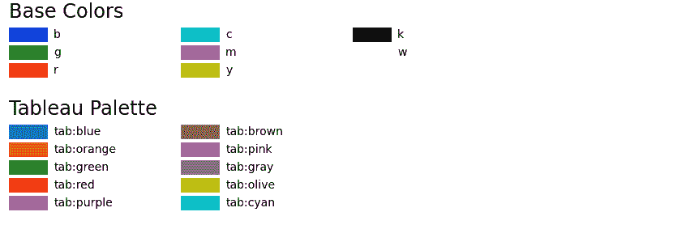
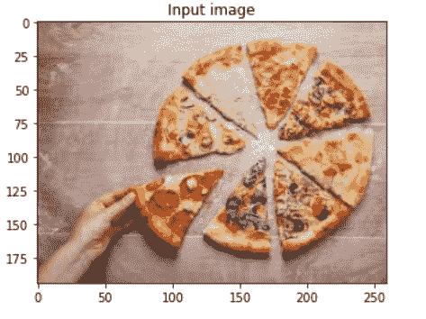
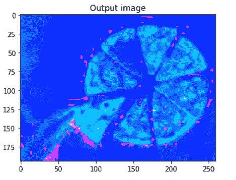

# Python 中的 Matplotlib.colors.rgb_to_hsv()

> 原文:[https://www . geesforgeks . org/matplotlib-colors-RGB _ to _ HSV-in-python/](https://www.geeksforgeeks.org/matplotlib-colors-rgb_to_hsv-in-python/)

**[Matplotlib](http://geeksforgeeks.org/python-matplotlib-an-overview/)** 是 Python 中一个惊人的可视化库，用于数组的 2D 图。Matplotlib 是一个多平台数据可视化库，构建在 NumPy 数组上，旨在与更广泛的 SciPy 堆栈一起工作。

## matplotlib.colors.rgb_to_hsv()

**matplotlib . colors . RGB _ to _ HSV()**功能属于 **matplotlib.colors** 模块。`matplotlib.colors.rgb_to_hsv()`功能用于将 0 到 1 范围内的浮点 rgb 转换为 hsv 值的 numpy 数组。

> **语法:**matplotlib . colors . RGB _ to _ HSV(arr)
> 
> **参数:**
> 
> *   **arr:** 它是一个类似数组的参数，形式为(…，3)，其中所有值必须在 0 到 1 的范围内。
> 
> **返回:**
> 
> *   **hsv:** 它以(…，3)的形式返回一个数组，该数组由转换为 0 到 1 范围内的 hsv 值的颜色组成。

**例 1:**

```py
import matplotlib.pyplot as plt
import matplotlib.colors as mcolors

# helper function to plot a 
# color table
def colortable(colors, title, 
               colors_sort = True,
               emptycols=0):

    # cell dimensions
    width = 212
    height = 22
    swatch_width = 48
    margin = 12
    topmargin = 40

    # Sorting colors based on hue,
    # saturation, value and name.
    if colors_sort is True:
        to_hsv = sorted((tuple(mcolors.rgb_to_hsv(mcolors.to_rgb(color))),
                         name)
                        for name, color in colors.items())
        names = [name for hsv, name in to_hsv]
    else:
        names = list(colors)

    length_of_names = len(names)
    length_cols = 4 - emptycols
    length_rows = length_of_names // length_cols + int(length_of_names % length_cols > 0)

    width2 = width * 4 + 2 * margin
    height2 = height * length_rows + margin + topmargin
    dpi = 72

    figure, axes = plt.subplots(figsize=(width2 / dpi, height2 / dpi),
                                dpi=dpi)

    figure.subplots_adjust(margin/width2, margin/height2,
                           (width2-margin)/width2, 
                           (height2-topmargin)/height2)

    axes.set_xlim(0, width * 4)
    axes.set_ylim(height * (length_rows-0.5), -height/2.)
    axes.yaxis.set_visible(False)
    axes.xaxis.set_visible(False)
    axes.set_axis_off()
    axes.set_title(title, fontsize=24, loc="left", pad=10)

    for i, name in enumerate(names):
        rows = i % length_rows
        cols = i // length_rows
        y = rows * height

        swatch_start_x = width * cols
        swatch_end_x = width * cols + swatch_width
        text_pos_x = width * cols + swatch_width + 7

        axes.text(text_pos_x, y, name, fontsize=14,
                horizontalalignment='left',
                verticalalignment='center')

        axes.hlines(y, swatch_start_x, swatch_end_x,
                  color=colors[name], linewidth=18)

    return figure

colortable(mcolors.BASE_COLORS, "Base Colors",
                colors_sort=False, emptycols=1)
colortable(mcolors.TABLEAU_COLORS, "Tableau Palette",
                colors_sort=False, emptycols=2)
colortable(mcolors.CSS4_COLORS, "CSS Colors")

plt.show()
```

**输出:**



**例 2:**

**使用的图像:**



```py
import matplotlib
import matplotlib.pyplot as plt
import matplotlib.image as mpimg

image = mpimg.imread('food.jpeg')
plt.title("Output image")

hsv = matplotlib.colors.rgb_to_hsv(image)
plt.imshow(hsv)
```

 **输出:**
