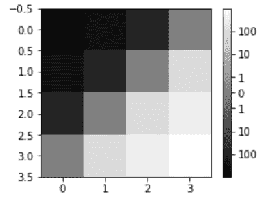

# Python 中的 Matplotlib.colors.SymLogNorm 类

> 原文:[https://www . geeksforgeeks . org/matplotlib-colors-symlognorm-in-class-python/](https://www.geeksforgeeks.org/matplotlib-colors-symlognorm-class-in-python/)

**Matplotlib** 是 Python 中一个惊人的可视化库，用于数组的 2D 图。Matplotlib 是一个多平台数据可视化库，构建在 NumPy 数组上，旨在与更广泛的 SciPy 堆栈一起工作。

**注:**更多信息请参考[Python Matplotlib–概述](http://geeksforgeeks.org/python-matplotlib-an-overview/)

## matplotlib.colors.SysLogNorm 中的值

**matplotlib . colors . syslognorm**类属于 **matplotlib.colors** 模块。matplotlib.colors 模块用于将颜色或数字参数转换为 RGBA 或 RGB。该模块用于将数字映射到颜色，或者在一维颜色数组(也称为颜色映射)中进行颜色规格转换。

matplotlib.colors.SymLogNorm 类用于从原点到正负方向的对称对数缩放。当接近零范围的值趋向于无穷大时，需要在零附近有一个线性范围。曲线呈线性的范围称为直线。线性范围(-linthresh 到+linthresh)在 linscale 的帮助下相对于对数范围进行扩展。线性范围的每一半所用的十年数就是它的值。例如，如果 linscale==1.0(这也是默认值)，则线性范围的正半部分和负半部分所覆盖的空间相当于对数范围内的十年。

类的方法:

1.  **自动缩放(自身，A):** 用于设置 A 的 Vmax 和 Vmin
2.  **autoscale_None(self，A):** 用于自动缩放以 None 为值的 vmax vmin。
3.  **倒数(自我，值):**它返回数值的对数倒数。

**例 1:**

```py
import numpy as np
import matplotlib.pyplot as plt
import matplotlib.colors as colors

# SymLogNorm: two humps, one 
# negative and one positive
N = 100
A, B = np.mgrid[-3:3:complex(0, N), -2:2:complex(0, N)]
C1 = np.exp(-A**2 - B**2)
C2 = np.exp(-(A - 1)**2 - (B - 1)**2)
C = (C1 - C2) * 2

figure, axes = plt.subplots(2, 1)

pcm = axes[0].pcolormesh(A, B, C,
                       norm = colors.SymLogNorm(linthresh = 0.03,
                                                linscale = 0.03,
                                                vmin =-1.0, 
                                                vmax = 1.0),
                       cmap ='RdBu_r')

figure.colorbar(pcm, ax = axes[0], extend ='both')

pcm = axes[1].pcolormesh(A, B, C, 
                         cmap ='RdBu_r',
                         vmin =-np.max(C))

figure.colorbar(pcm, ax = axes[1],
                extend ='both')

plt.show()
```

**输出** :


**例 2:**

```py
import numpy as np
import matplotlib.pyplot as plt
from matplotlib import colors, ticker

# helper function to 
# show syslognorm in action
def symlog(arr, vmin = None, vmax = None,
           logthresh = 5, logstep = 1,
           linscale = 1, **kwargs):

    vmin = arr.min() if vmin is None else vmin
    vmax = arr.max() if vmax is None else vmax
    image = plt.imshow(arr,
                       vmin = float(vmin),
                       vmax = float(vmax),
                       norm = colors.SymLogNorm(10**-logthresh,
                                                linscale = linscale),
                       **kwargs)

    maxlog = int(np.ceil(np.log10(vmax)))
    minlog = int(np.ceil(np.log10(-vmin)))

    # generate logarithmic ticks
    tick_locations =([-(10**x) for x in range(-logthresh,
                                             minlog + 1,
                                             logstep)][::-1]
                    +[0.0]
                    +[(10**x) for x in range(-logthresh,
                                             maxlog + 1,
                                             logstep)] )

    cb = plt.colorbar(ticks = tick_locations, 
                    format = ticker.LogFormatter())

    return image, cb

data = np.arange(4).reshape(-1, 1)+np.arange(4).reshape(1, -1)
data = 10**(data / 2.)
data2 = data - data[::-1, ::-1]
plt.figure(figsize =(4, 3))  
image, cb = symlog(data2, interpolation ="None",
                   cmap ="gray", logthresh = 0)
plt.show()
```

**输出:**
