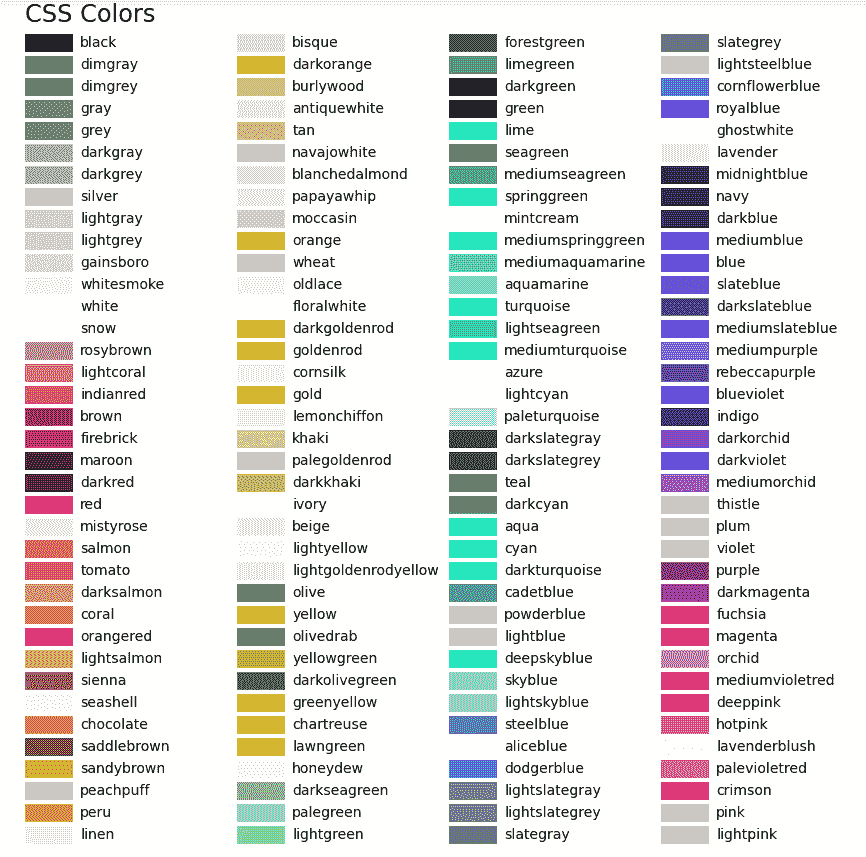
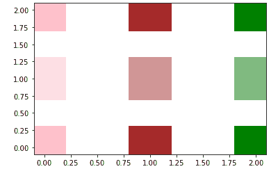

# Python 中的 Matplotlib.colors.to_rgb()

> 原文:[https://www . geesforgeks . org/matplotlib-colors-to _ RGB-in-python/](https://www.geeksforgeeks.org/matplotlib-colors-to_rgb-in-python/)

[**Matplotlib**](https://www.geeksforgeeks.org/python-matplotlib-an-overview/) 是 Python 中一个惊人的可视化库，用于数组的 2D 图。Matplotlib 是一个多平台数据可视化库，构建在 NumPy 数组上，旨在与更广泛的 SciPy 堆栈一起工作。

## matplotlib.colors.to_rgb()

matplotlib.colors.to_rgb()函数用于将 c(即颜色)转换为 rgb 颜色。它将颜色名称转换为 RGB 编码颜色的数组。它返回一个由 0-1 三个浮点数组成的 RGB 元组。

> **语法:**matplotlib . colors . to _ RGB(c)
> T3】参数:T5】
> 
> *   **c:** 这接受一个代表颜色名称的字符串。它可以是 RGB 或 RGBA 序列，也可以是几种形式的字符串:
>     1.  十六进制颜色字符串，如“# 000 fff”
>         
>     2.  一个标准的名字，像‘绿色’
>         
>     3.  一封来自《rgbcmykw》
>         的信
>     4.  浮点数的字符串表示，如“0.4”，在 0-1 标度上表示灰色

**例 1:**

## 蟒蛇 3

```
import matplotlib.pyplot as plt
import matplotlib.colors as mcolors

# helper function to plot a color table
def colortable(colors, title, colors_sort = True, emptycols = 0):

    # cell dimensions
    width = 212
    height = 22
    swatch_width = 48
    margin = 12
    topmargin = 40

    # Sorting colors based on hue, saturation,
    # value and name.
    if colors_sort is True:
        to_hsv = sorted((tuple(mcolors.rgb_to_hsv(mcolors.to_rgb(color))),
                         name)
                        for name, color in colors.items())

        names = [name for hsv, name in to_hsv]

    else:
        names = list(colors)

    length_of_names = len(names)
    length_cols = 4 - emptycols
    length_rows = length_of_names // length_cols + int(length_of_names % length_cols > 0)

    width2 = width * 4 + 2 * margin
    height2 = height * length_rows + margin + topmargin
    dpi = 72

    figure, axes = plt.subplots(figsize =(width2 / dpi, height2 / dpi), dpi = dpi)
    figure.subplots_adjust(margin / width2, margin / height2,
                        (width2-margin)/width2, (height2-topmargin)/height2)

    axes.set_xlim(0, width * 4)
    axes.set_ylim(height * (length_rows-0.5), -height / 2.)
    axes.yaxis.set_visible(False)
    axes.xaxis.set_visible(False)
    axes.set_axis_off()
    axes.set_title(title, fontsize = 24, loc ="left", pad = 10)

    for i, name in enumerate(names):

        rows = i % length_rows
        cols = i // length_rows
        y = rows * height

        swatch_start_x = width * cols
        swatch_end_x = width * cols + swatch_width
        text_pos_x = width * cols + swatch_width + 7

        axes.text(text_pos_x, y, name, fontsize = 14,
                horizontalalignment ='left',
                verticalalignment ='center')

        axes.hlines(y, swatch_start_x, swatch_end_x,
                  color = colors[name], linewidth = 18)

    return figure

colortable(mcolors.BASE_COLORS, "Base Colors",
                colors_sort = False, emptycols = 1)
colortable(mcolors.TABLEAU_COLORS, "Tableau Palette",
                colors_sort = False, emptycols = 2)
colortable(mcolors.CSS4_COLORS, "CSS Colors")

plt.show()
```

**输出:**




**例 2:**

## 蟒蛇 3

```
from matplotlib import colors
import matplotlib.pyplot as plt

alpha = 0.5

kwargs = dict(edgecolors ='none', s = 3900, marker ='s')

for i, color in enumerate(['pink', 'brown', 'green']):

    rgb = colors.to_rgb(color)
    plt.scatter([i], [0], color = color, **kwargs)
    plt.scatter([i], [1], color = color,
                alpha = alpha, **kwargs)
    plt.scatter([i], [2], color = rgb, **kwargs)
```

**输出:**

