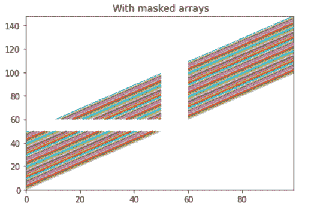

# Python 中的 Matplotlib.colors.to_rgba()

> 原文:[https://www . geesforgeks . org/matplotlib-colors-to _ rgba-in-python/](https://www.geeksforgeeks.org/matplotlib-colors-to_rgba-in-python/)

[**Matplotlib**](https://www.geeksforgeeks.org/python-matplotlib-an-overview/) 是 Python 中一个惊人的可视化库，用于数组的 2D 图。Matplotlib 是一个多平台数据可视化库，构建在 NumPy 数组上，旨在与更广泛的 SciPy 堆栈一起工作。

## matplotlib.colors.to_rgba()

matplotlib.colors.to_rgba()函数用于将 c(颜色)转换为 rgba 颜色。它将颜色名称转换为 RGBA 编码颜色的数组。它从 0-1 返回一个由四个浮点数组成的 RGBA 元组。

> **语法:** matplotlib.colors.to_rgba(c，alpha=None)
> **参数:**
> 
> *   **c:** 是 matplotlib 颜色或 np.ma.masked 颜色。
>     
> *   **alpha:** 它是一个接受标量的可选参数。如果 alpha 不是“无”，则强制使用 alpha 值。但是如果 c 是“none”(区分大小写)，它就会映射到(0，0，0，0)。
>     
> 
> **返回:**它以(r，g，b，a)的形式返回标量的元组。

**例 1:**

## 蟒蛇 3

```
import matplotlib.pyplot as plt
from matplotlib.collections import LineCollection
from matplotlib import colors as mcolors
import numpy as np

# simple example showing many
# lines in a single set of axes
x_axis = np.arange(100)

# Here are different sets of
# y to plot vs x
y_axis = x_axis[:50, np.newaxis] + x_axis[np.newaxis, :]

segements = np.zeros((50, 100, 2))
segements[:, :, 1] = y_axis
segements[:, :, 0] = x_axis

#some supported values to test 
# masked array :
segements = np.ma.masked_where((segements > 50) & (segements < 60),
                               segements)

# setting the plot limits.
figure, axes = plt.subplots()
axes.set_xlim(x_axis.min(), x_axis.max())
axes.set_ylim(y_axis.min(), y_axis.max())

# colors is sequence of rgba 
# tuples and .rgba implementation
colors = [mcolors.to_rgba(c)
          for c in plt.rcParams['axes.prop_cycle'].by_key()['color']]

line_segments = LineCollection(segements,
                               linewidths = (0.5, 1, 1.5, 2),
                               colors = colors,
                               linestyle = 'solid')

axes.add_collection(line_segments)
axes.set_title(' With masked arrays')
plt.show()
```

**输出:**



**例 2:**

## 蟒蛇 3

```
import matplotlib.pyplot as plt
import matplotlib.colors as mcolors

# helper function to plot a color table
def colortable(colors, title, 
               colors_sort = True,
               emptycols = 0):

    # cell dimensions
    width = 212
    height = 22
    swatch_width = 48
    margin = 12
    topmargin = 40

    # Sorting colors based on hue,
    # saturation, value and name.
    # implementation of to_rgb
    if colors_sort is True:
        to_hsv = sorted((tuple(mcolors.rgb_to_hsv(mcolors.to_rgba(color)[:3])),
                         name)
                        for name, color in colors.items())
        names = [name for hsv, name in to_hsv]
    else:
        names = list(colors)

    length_of_names = len(names)
    length_cols = 4 - emptycols
    length_rows = length_of_names // length_cols + int(length_of_names % length_cols > 0)

    width2 = width * 4 + 2 * margin
    height2 = height * length_rows + margin + topmargin
    dpi = 72

    figure, axes = plt.subplots(figsize =(width2 / dpi, height2 / dpi), dpi = dpi)
    figure.subplots_adjust(margin / width2, margin / height2,
                           (width2-margin)/width2,
                           (height2-topmargin)/height2)

    axes.set_xlim(0, width * 4)
    axes.set_ylim(height * (length_rows-0.5), -height / 2.)
    axes.yaxis.set_visible(False)
    axes.xaxis.set_visible(False)
    axes.set_axis_off()
    axes.set_title(title, fontsize = 24, loc ="left", pad = 10)

    for i, name in enumerate(names):
        rows = i % length_rows
        cols = i // length_rows
        y = rows * height

        swatch_start_x = width * cols
        swatch_end_x = width * cols + swatch_width
        text_pos_x = width * cols + swatch_width + 7

        axes.text(text_pos_x, y, name, fontsize = 14,
                horizontalalignment ='left',
                verticalalignment ='center')

        axes.hlines(y, swatch_start_x, swatch_end_x,
                  color = colors[name], linewidth = 18)

    return figure

colortable(mcolors.BASE_COLORS, "Base Colors",
                colors_sort = False, emptycols = 1)
colortable(mcolors.TABLEAU_COLORS, "Tableau Palette",
                colors_sort = False, emptycols = 2)
colortable(mcolors.CSS4_COLORS, "CSS Colors")

plt.show()
```

**输出:**


