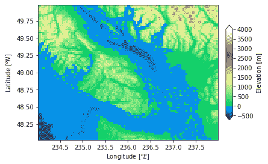
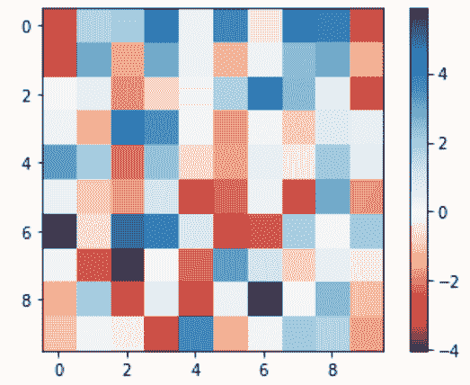

# Python 中的 matplotlib . colors . two loperom 类

> 原文:[https://www . geeksforgeeks . org/matplotlib-colors-two loperom-in-class-python/](https://www.geeksforgeeks.org/matplotlib-colors-twoslopenorm-class-in-python/)

[**Matplotlib**](https://www.geeksforgeeks.org/python-matplotlib-an-overview/) 是 Python 中一个惊人的可视化库，用于数组的 2D 图。Matplotlib 是一个多平台数据可视化库，构建在 NumPy 数组上，旨在与更广泛的 SciPy 堆栈一起工作。

## matplot lib . colors . two shape-图面格式

matplotlib . colors . two lop norm 类用于使用 set center 对数据进行规范化。当围绕概念中心映射变化率不相等的数据时，它就派上用场了。例如，在-3 到 6 之间的范围有一个中心 0。

> **语法:**class matplotlib . colors . two lopernom(vcenter，vmin=None，vmax=None)
> **参数:**
> 
> 1.  **vcenter:** 它保存一个浮点值，在标准化中定义为 0.5。
>     
> 2.  **vmin:** 这是一个可选参数，在归一化中定义数据值 0.0。它默认为数据集的最小值。
>     
> 3.  **vmax:** 这是一个可选参数，定义了归一化中的数据值 1.0。它默认为数据集的最大值。

**法班:**

*   **autoscale_none(self，A):** 此方法用于通过获取 vmax 和 vmin 来对 vcenter 进行削波。

**例 1:**

## 蟒蛇 3

```py
import numpy as np
import matplotlib.pyplot as plt
import matplotlib.cbook as cbook
import matplotlib.colors as colors

file = cbook.get_sample_data('topobathy.npz',
                             asfileobj = False)

with np.load(file) as example:
    topo = example['topo']
    longi = example['longitude']
    latit = example['latitude']

figure, axes = plt.subplots(constrained_layout = True)

# creating a colormap that has land
# and ocean clearly delineated and
# of the same length (256 + 256)
undersea = plt.cm.terrain(np.linspace(0, 0.17, 256))
land = plt.cm.terrain(np.linspace(0.25, 1, 256))
every_colors = np.vstack((undersea, land))
terrain_map = colors.LinearSegmentedColormap.from_list('terrain_map',
    every_colors)

# the center is offset so that
# the land has more dynamic range
# while making the norm
diversity_norm = colors.TwoSlopeNorm(vmin =-500,
                                     vcenter = 0,
                                     vmax = 4000)

pcm = axes.pcolormesh(longi, latit, topo,
                      rasterized = True,
                      norm = diversity_norm,

                      cmap = terrain_map, )
axes.set_xlabel('Longitude $[^o E]{content}apos;)
axes.set_ylabel('Latitude $[^o N]{content}apos;)
axes.set_aspect(1 / np.cos(np.deg2rad(49)))

figure.colorbar(pcm, shrink = 0.6, extend ='both',
                label ='Elevation [m]')
plt.show()
```

**输出:**



**例 2:**

## 蟒蛇 3

```py
import numpy as np
import matplotlib.pyplot as plt
import matplotlib.colors as mcolors

data = np.random.normal(.4, 2, (10, 10))

two_slope_norm = mcolors.TwoSlopeNorm(vmin = data.min(),
                                      vmax = data.max(),
                                      vcenter = 0)

plt.imshow(data, cmap = plt.cm.RdBu,
           norm = two_slope_norm)

plt.colorbar()
plt.show()
```

**输出:**

