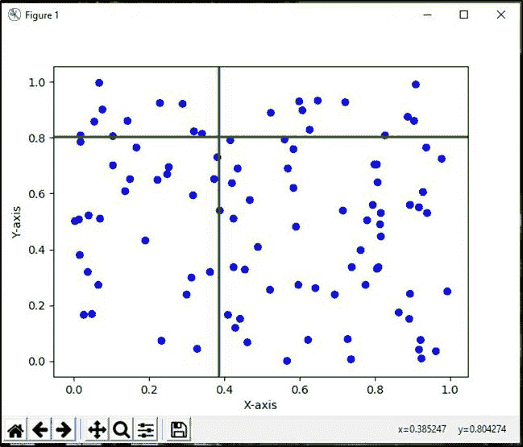
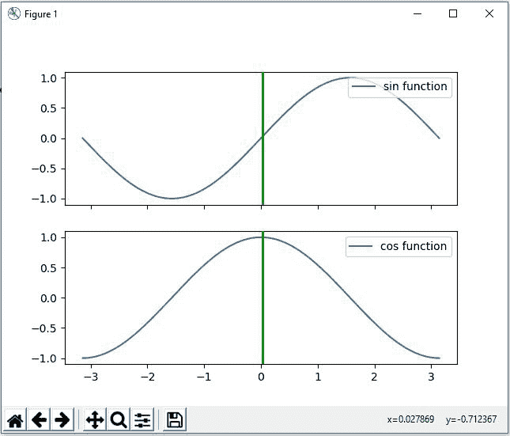
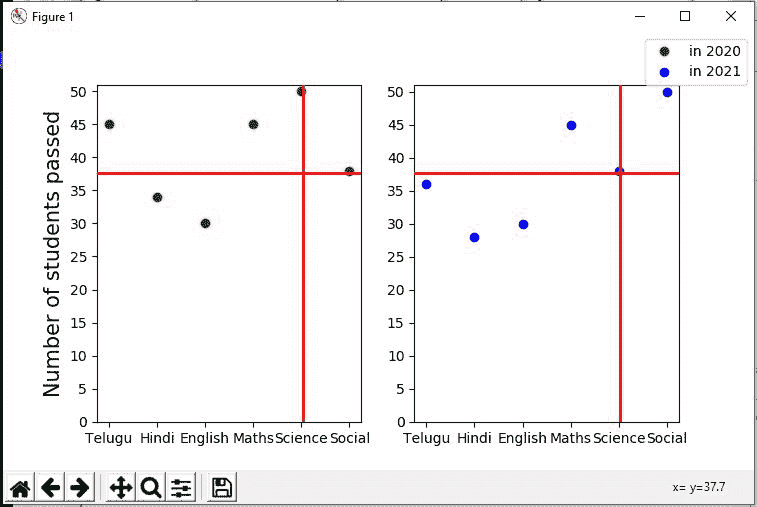

# matplotlib–游标元件

> 哎哎哎:# t0]https://www . geeksforgeeks . org/matplotlib 游标小部件/

[Matplotlib](https://www.geeksforgeeks.org/python-introduction-matplotlib/) 是 python 中的数据可视化库。它由许多专为任何图形用户界面后端设计的小部件组成。matplotlib 中小部件的一些例子是按钮、检查按钮、单选按钮、光标和文本框。本文讨论了 Matplotlib 库中的光标控件。

光标水平和/或垂直跨越轴，并随鼠标光标移动。

> **语法:**光标(ax，horizOn =真，vertOn =真，useblit =假，**lineprops)
> 
> **参数:**
> 
> *   **轴:**光标要附着的轴。
> *   **可选参数:**
> *   **地平线:**画水平线(默认:真)。
> *   **vertOn :** 绘制垂直线(默认:真)。
> *   **有用性:**如果后端支持，使用块传送以加快绘图速度(默认:假)。
> *   *** *线条道具:**控制线条外观(线宽、颜色)的线条属性。

**例 1:**

## 蟒蛇 3

```py
# importing cursor widget from matplotlib
from matplotlib.widgets import Cursor
import matplotlib.pyplot as plt
import numpy as np

fig = plt.figure()
ax = fig.add_axes([0.1, 0.1, 0.8, 0.8])

num = 100
x = np.random.rand(num)
y = np.random.rand(num)

ax.scatter(x, y, c='blue')
ax.set_xlabel('X-axis')
ax.set_ylabel('Y-axis')

cursor = Cursor(ax, color='green', linewidth=2)
plt.show()
```

**输出:**



在上面的输出中，光标可以在 matplotlib 轴上水平和垂直移动。我们可以在任何需要的地方拖动光标。

### 多光标

多光标用于同时在多个图上显示光标，即光标在多个轴之间共享。

> **语法:**
> 
> 多重游标(canvas、axes、useblit=True、horizOn=False、vertOn=True、**lineprops)

**示例:**

## 蟒蛇 3

```py
# Import MultiCursor from matplotlib
from matplotlib.widgets import MultiCursor
import matplotlib.pyplot as plt
import numpy as np

fig, (ax1, ax2) = plt.subplots(nrows=2, sharex=True)

x = np.linspace(-np.pi, np.pi, 256, endpoint=True)
y = np.sin(x)
z = np.cos(x)

ax1.plot(x, y, label="sin function")
ax1.legend(loc="upper right")
ax2.plot(x, z, label="cos function")

multi = MultiCursor(fig.canvas, (ax1, ax2), color='g', lw=2,
                    horizOn=False, vertOn=True)

ax2.legend(loc="upper right")
plt.show()
```

**输出:**



**示例:**

## 蟒蛇 3

```py
from matplotlib.widgets import MultiCursor
import matplotlib.pyplot as plt
import numpy as np

fig, (ax1, ax2) = plt.subplots(1, 2, figsize=(12, 5))

x1 = ['Telugu', 'Hindi', 'English',
      'Maths', 'Science', 'Social']
y1 = [45, 34, 30, 45, 50, 38]
y2 = [36, 28, 30, 45, 38, 50]

labels = ["in 2020", "in 2021"]

l1 = ax1.plot(x1, y1, 'o', color="green")
l2 = ax2.plot(x1, y2, 'o', color="blue")

ax1.set_yticks(np.arange(0, 51, 5))
ax2.set_yticks(np.arange(0, 51, 5))

ax1.set_ylabel('Number of students passed', fontsize=15)

fig.legend([l1, l2], labels=labels, loc="upper right")
cursor = MultiCursor(fig.canvas, (ax1, ax2), color='r',
                     lw=2, horizOn=True, vertOn=True)

plt.subplots_adjust(right=0.9)
plt.show()
```

**输出:**

