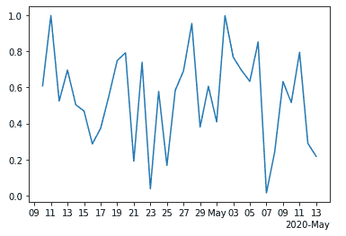
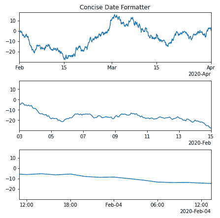

# Python 中的 matplotlib . date .简明日期格式化程序类

> 原文:[https://www . geeksforgeeks . org/matplotlib-date-简明日期格式器-python 中的类/](https://www.geeksforgeeks.org/matplotlib-dates-concisedateformatter-class-in-python/)

**[Matplotlib](https://www.geeksforgeeks.org/python-matplotlib-an-overview/)** 是 Python 中一个惊人的可视化库，用于数组的 2D 图。Matplotlib 是一个多平台数据可视化库，构建在 NumPy 数组上，旨在与更广泛的 SciPy 堆栈一起工作。

## matplot lib . dates . conciliate formatter-matplot lib . date-matplot lib . date .简明格式化程式

`matplotlib.dates.ConciseDateFormatter`类用于计算日期的最佳格式，并使其尽可能紧凑但完整。这更常用于`AutoDateLocator`。

> **语法:**class matplotlib . date .简明日期格式化程序(定位器，tz =无，formats =无，offset _ formats =无，zero _ formats =无，show _ offset =真)
> 
> **参数:**
> 
> *   **定位器:**该参数代表该轴使用的定位器。*   **tz:** 它是一个可选参数，接受传递给 dates.date2num 的字符串。*   **格式:**是 6 个字符串的可选列表。它用于格式化 6 个级别的刻度标签的字符串，如年、月、日、小时、分钟和秒。这些字符串的格式代码与 strftime 相同。其默认值为[ '%Y '，' %b '，' %d '，' %H:%M '，' %H:%M '，' %S.%f']*   **zero_formats:** 是 6 个字符串的可选列表。它用于格式化任何给定刻度级别的“零”刻度标签的字符串。例如，如果大多数刻度是月份，2020 年 2 月 1 日左右的刻度将被标记为“1 月”，2020 年标记为“3 月”。其默认值为["，' %Y '，' %b '，' %b-%d '，' %H:%M '，' %H:%M']。*   **offset_formats:** 是 6 个字符串的可选列表。它用于格式化应用于 x 轴右侧或 y 轴顶部“偏移”字符串的 6 个级别的字符串。当与刻度标签结合时，这应该完全指定日期。默认值为["，' %Y '，' %Y-%b '，' %Y-%b-%d '，' %Y-%b-%d '，' %Y-%b-%d '，' %Y-%b-%d %H:%M']。*   **show_offset:** 接受布尔值，决定是否显示 offset。默认情况下，它设置为“真”。

**例 1:**

```
import numpy as np
import matplotlib.dates as mdates
import matplotlib.pyplot as plt

# dummy date
dummy_date = np.arange("2020-04-10", 
                       "2020-05-14",
                       dtype ="datetime64")

random_x = np.random.rand(len(dummy_date))

figure, axes = plt.subplots()

axes.plot(dummy_date, random_x)
axes.xaxis.set(
    major_locator = mdates.AutoDateLocator(minticks = 1,
                                           maxticks = 5),
)

locator = mdates.AutoDateLocator(minticks = 15,
                                 maxticks = 20)
formatter = mdates.ConciseDateFormatter(locator)

axes.xaxis.set_major_locator(locator)
axes.xaxis.set_major_formatter(formatter)

plt.show()
```

**输出:**


**例 2:**

```
import datetime
import matplotlib.pyplot as plt
import matplotlib.dates as mdates
import numpy as np

dummy_date = datetime.datetime(2020, 2, 1)

# random date generator
dates = np.array([dummy_date + datetime.timedelta(hours =(2 * i))
                  for i in range(732)])
date_length = len(dates)

np.random.seed(194567801)
y_axis = np.cumsum(np.random.randn(date_length))

lims = [(np.datetime64('2020-02'), 
         np.datetime64('2020-04')),
        (np.datetime64('2020-02-03'), 
         np.datetime64('2020-02-15')),
        (np.datetime64('2020-02-03 11:00'), 
         np.datetime64('2020-02-04 13:20'))]

figure, axes = plt.subplots(3, 1, 
                            constrained_layout = True, 
                            figsize =(6, 6))

for nn, ax in enumerate(axes):

    locator = mdates.AutoDateLocator(minticks = 3, maxticks = 7)
    formatter = mdates.ConciseDateFormatter(locator)

    ax.xaxis.set_major_locator(locator)
    ax.xaxis.set_major_formatter(formatter)

    ax.plot(dates, y_axis)
    ax.set_xlim(lims[nn])

axes[0].set_title('Concise Date Formatter')

plt.show()
```

**输出:**
