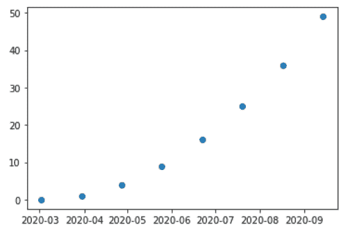
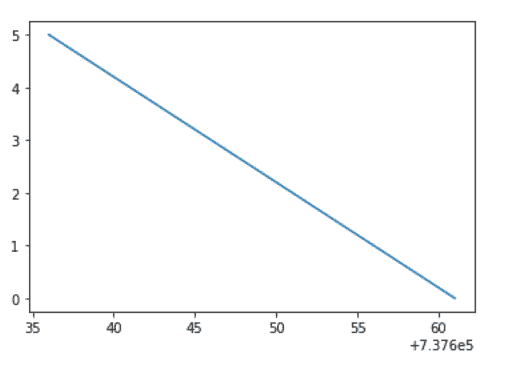

# matplotlib . dates . inct()用 Python

表示

> 哎哎哎:# t0]https://www . geeksforgeeks . org/matplot lib-dates-in-python/

**[Matplotlib](https://www.geeksforgeeks.org/python-matplotlib-an-overview/)** 是 Python 中一个惊人的可视化库，用于数组的 2D 图。Matplotlib 是一个多平台数据可视化库，构建在 NumPy 数组上，旨在与更广泛的 SciPy 堆栈一起工作。

## matplotlib . date . inct()

`matplotlib.dates.drange()`函数返回一系列等间距的 Matplotlib 日期。日期范围从“dstart”开始，直到，但不包括“dend”。每个日期之间的间隔称为增量。

> **语法:**matplotlib . dates . inct(dstart，dend，delta)
> 
> **参数:**
> 
> 1.  **dstart:** 日期范围的起点，是 python 的日期时间。
> 2.  **dend:** 日期范围的结束点，是 python 的日期时间。
> 3.  **delta:** 表示每个日期之间的间距，属于 python 的 datetime.timedelta。
> 
> **返回:**它返回一个 numpy 数组，这是一个表示 Matplotlib 日期的浮点数列表。

**例 1:**

```
import datetime
import matplotlib.pyplot as plt
from matplotlib.dates import DayLocator, HourLocator, DateFormatter, drange
import numpy as np

date_1 = datetime.datetime( 2020, 3, 2)
date_2 = datetime.datetime( 2020, 10, 10)

time_delta = datetime.timedelta(days = 28)
dates = drange(date_1, date_2, time_delta)

y_axis = np.arange( len(dates) )

fig, ax = plt.subplots()
ax.plot_date(dates, y_axis * y_axis)

ax.xaxis.set_major_formatter( DateFormatter('% Y-% m') )

plt.show()
```

**输出:**


**例 2:**

```
import datetime
import matplotlib.pyplot as plt
import matplotlib.dates as mdates

date = [datetime.datetime(2020, 8, 24, 0, 0),
        datetime.datetime(2020, 8, 23, 0, 0), 
        datetime.datetime(2020, 8, 22, 0, 0), 
        datetime.datetime(2020, 8, 21, 0, 0), 
        datetime.datetime(2020, 8, 18, 0, 0),
        datetime.datetime(2020, 8, 17, 0, 0),
        datetime.datetime(2020, 8, 16, 0, 0),
        datetime.datetime(2020, 8, 15, 0, 0),
        datetime.datetime(2020, 8, 14, 0, 0),
        datetime.datetime(2020, 8, 11, 0, 0),
        datetime.datetime(2020, 8, 10, 0, 0), 
        datetime.datetime(2020, 8, 9, 0, 0),
        datetime.datetime(2020, 8, 8, 0, 0),
        datetime.datetime(2020, 8, 7, 0, 0),
        datetime.datetime(2020, 8, 4, 0, 0),
        datetime.datetime(2020, 8, 3, 0, 0),
        datetime.datetime(2020, 8, 2, 0, 0),
        datetime.datetime(2020, 8, 1, 0, 0)]

# is a datetime.datetime object 
# according to type
start_date = date[0]

# is a datetime.datetime object according 
# to type    
end_date = date[-1]
delta = datetime.timedelta(days = 5)

# the drange function
dates = mdates.drange(start_date, end_date, -delta)
y_data = range(len(dates))

plt.plot(dates, y_data)
```

**输出:**
