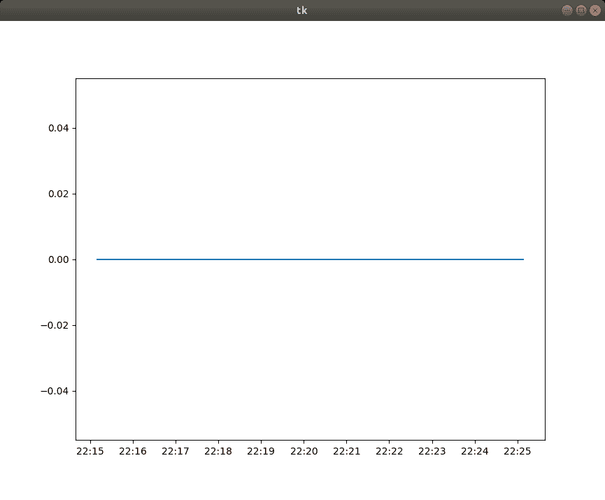

# Python 中的 matplotlib . date . epoch 2 num()

> 原文:[https://www . geesforgeks . org/matplotlib-date-epoch 2 num-in-python/](https://www.geeksforgeeks.org/matplotlib-dates-epoch2num-in-python/)

[Matplotlib](https://www.geeksforgeeks.org/python-matplotlib-an-overview/) 是 Python 中一个惊人的可视化库，用于数组的 2D 图。Matplotlib 是一个多平台数据可视化库，构建在 NumPy 数组上，旨在与更广泛的 SciPy 堆栈一起工作。

## matplotlib . dates . epoch 2 num()

`matplotlib.dates.epoch2num()`功能用于从 0001 开始将一个纪元或一系列纪元转换为新的日期格式。

> **语法:**matplotlib . dates . epoch 2 num(e)
> 
> **参数:**
> 
> *   **e:** 可以是一个纪元，也可以是一系列纪元。
> 
> **返回:**从 0001 日开始的新日期格式。

**例 1:**

```py
import random
import matplotlib.pyplot as plt
import matplotlib.dates as mdates

# generate some random data
# for approx 5 yrs
random_data = [float(random.randint(1487517521,
                                    14213254713))
               for _ in range(1000)]

# convert the epoch format to
# matplotlib date format 
mpl_data = mdates.epoch2num(random_data)

# plotting the graph
fig, axes = plt.subplots(1, 1)
axes.hist(mpl_data, bins = 51, color ='green')
locator = mdates.AutoDateLocator()

axes.xaxis.set_major_locator(locator)
axes.xaxis.set_major_formatter(mdates.AutoDateFormatter(locator))

plt.show()
```

 **输出:**


**例 2:**

```py
from tkinter import *
from tkinter import ttk
import time 
import matplotlib
import queue
from matplotlib.backends.backend_tkagg import FigureCanvasTkAgg, NavigationToolbar2Tk
from matplotlib.figure import Figure
import matplotlib.animation as animation
import matplotlib.dates as mdate

root = Tk()

graphXData = queue.Queue()
graphYData = queue.Queue()

def animate(objData):

    line.set_data(list(graphXData.queue), 
                  list(graphYData.queue))

    axes.relim()
    axes.autoscale_view()

figure = Figure(figsize =(5, 5), dpi = 100)
axes = figure.add_subplot(111)
axes.xaxis_date()

line, = axes.plot([], [])
axes.xaxis.set_major_formatter(mdate.DateFormatter('%H:%M'))

canvas = FigureCanvasTkAgg(figure, root)
canvas.get_tk_widget().pack(side = BOTTOM, 
                            fill = BOTH, 
                            expand = True)

for cnt in range (600):

    graphXData.put(matplotlib.dates.epoch2num(time.time()-(600-cnt)))
    graphYData.put(0)

ani = animation.FuncAnimation(figure, animate, interval = 1000)

root.mainloop()
```

**输出:**
