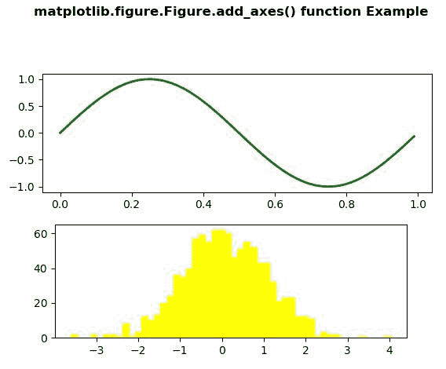
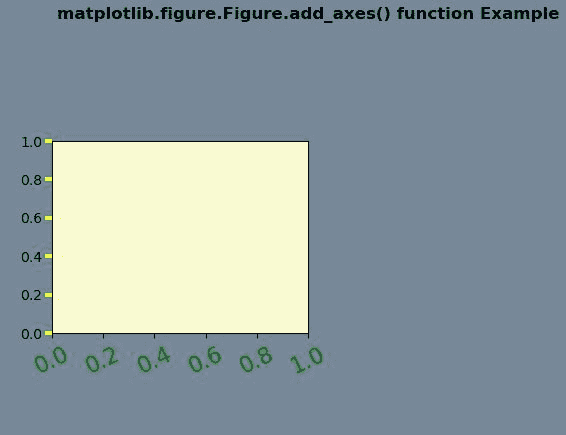

# Python 中的 matplotlib . figure . figure . add _ axes()

> 原文:[https://www . geesforgeks . org/matplotlib-figure-figure-add _ axes-in-python/](https://www.geeksforgeeks.org/matplotlib-figure-figure-add_axes-in-python/)

**[Matplotlib](https://www.geeksforgeeks.org/python-introduction-matplotlib/)** 是 Python 中的一个库，是 NumPy 库的数值-数学扩展。**人物模块**提供了顶级的艺术家，人物，包含了所有的剧情元素。该模块用于控制所有情节元素的子情节和顶层容器的默认间距。

## matplotlib . figure . figure . add _ axes()函数

**matplotlib 库的 add_axes()方法**图形模块用于给图形添加一个轴。

> **语法:** add_axes(self，*args，**kwargs)
> 
> **参数:**这接受下面描述的以下参数:
> 
> *   **矩形:**此参数是新轴的尺寸[左、底、宽、高]。
> *   **投影:**该参数是轴的投影类型。
> *   **sharex，sharey :** 这些参数与 sharex 和/或 sharey 共享 x 轴或 y 轴。
> *   **标签:**该参数是返回轴的标签。
> 
> **返回:**该方法根据使用的投影返回轴类。

下面的例子说明了 matplotlib.figure . figure . add _ axes()函数在 matplotlib . figure 中的作用:

**例 1:**

```py
# Implementation of matplotlib function
import numpy as np
import matplotlib.pyplot as plt

fig = plt.figure()
fig.subplots_adjust(top = 0.8)
ax1 = fig.add_subplot(211)

t = np.arange(0.0, 1.0, 0.01)
s = np.sin(2 * np.pi * t)
line, = ax1.plot(t, s, color ='green', lw = 2)

np.random.seed(19680801)

ax2 = fig.add_axes([0.15, 0.1, 0.7, 0.3])
n, bins, patches = ax2.hist(np.random.randn(1000), 50,
                            facecolor ='yellow',
                            edgecolor ='yellow')

fig.suptitle('matplotlib.figure.Figure.add_axes() \
function Example\n\n', fontweight ="bold")

plt.show()
```

**输出:**


**示例-2:**

```py
# Implementation of matplotlib function
import numpy as np
import matplotlib.pyplot as plt

fig = plt.figure()
rect = fig.patch
rect.set_facecolor('lightslategray')

ax1 = fig.add_axes([0.1, 0.3, 0.4, 0.4])
rect = ax1.patch
rect.set_facecolor('lightgoldenrodyellow')

for label in ax1.xaxis.get_ticklabels():
    label.set_color('green')
    label.set_rotation(25)
    label.set_fontsize(16)

for line in ax1.yaxis.get_ticklines():
    line.set_color('yellow')
    line.set_markersize(5)
    line.set_markeredgewidth(3)

fig.suptitle('matplotlib.figure.Figure.add_axes() \
function Example\n\n', fontweight ="bold")

plt.show()
```

**输出:**
