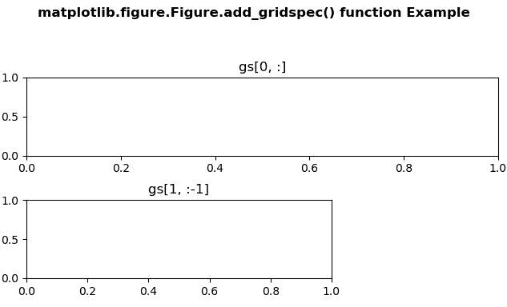
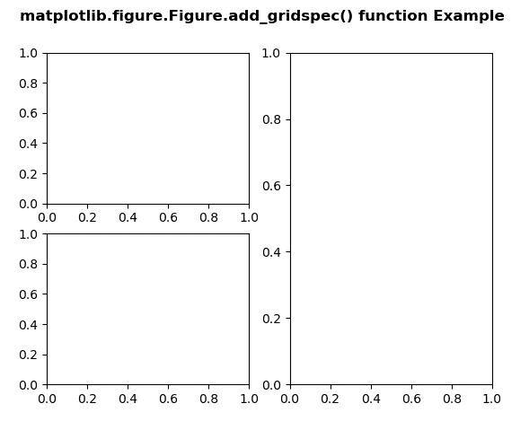

# Python 中的 matplotlib . figure . figure . add _ grid spec()

> 原文:[https://www . geeksforgeeks . org/matplotlib-figure-figure-add _ gridspec-in-python/](https://www.geeksforgeeks.org/matplotlib-figure-figure-add_gridspec-in-python/)

**[Matplotlib](https://www.geeksforgeeks.org/python-introduction-matplotlib/)** 是 Python 中的一个库，是 NumPy 库的数值-数学扩展。**人物模块**提供了顶级的艺术家，人物，包含了所有的剧情元素。该模块用于控制所有情节元素的子情节和顶层容器的默认间距。

## matplotlib . figure . figure . add _ grid spec()函数

**matplotlib 库的 add_gridspec()方法**图形模块用来获取以此图形为父图形的 gridspec。

> **语法:** add_gridspec(self，nrows，ncols，**kwargs)
> 
> **参数:**这接受下面描述的以下参数:
> 
> *   **n 显示:**该参数是网格中的行数。
> *   **ncols :** 此参数是网格中的列数。
> 
> **返回:**此方法返回 **GridSpec** 。

下面的例子说明了 matplotlib.figure . figure . add _ grid spec()函数在 matplotlib . figure 中的作用:

**例 1:**

```
# Implementation of matplotlib function
import matplotlib
import matplotlib.pyplot as plt
import matplotlib.gridspec as gridspec

fig = plt.figure(constrained_layout = True)
gs = fig.add_gridspec(3, 3)
ax = fig.add_subplot(gs[0, :])
ax.set_title('gs[0, :]')
ax2 = fig.add_subplot(gs[1, :-1])
ax2.set_title('gs[1, :-1]')

fig.suptitle('matplotlib.figure.Figure.add_gridspec() \
function Example\n\n', fontweight ="bold")

plt.show()
```

**输出:**


**例 2:**

```
# Implementation of matplotlib function
import matplotlib
import matplotlib.pyplot as plt
import matplotlib.gridspec as gridspec

fig = plt.figure()
gs = fig.add_gridspec(2, 2)
ax1 = fig.add_subplot(gs[0, 0])
ax2 = fig.add_subplot(gs[1, 0])
ax3 = fig.add_subplot(gs[:, 1])

fig.suptitle('matplotlib.figure.Figure.add_gridspec()\
 function Example\n\n', fontweight ="bold")

plt.show()
```

**输出:**
