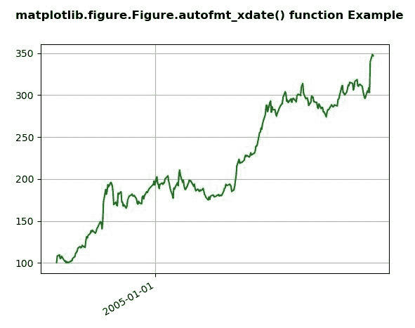
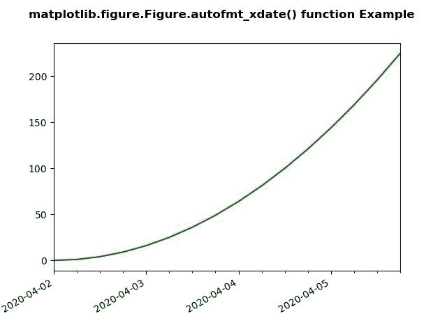

# matplotlib . figure . figure . automt _ xdate()中的 Python

> 哎哎哎:# t0]https://www . geeksforgeeks . org/matplotlib-figure-automt _ xdate-in-python/中

**[Matplotlib](https://www.geeksforgeeks.org/python-introduction-matplotlib/)** 是 Python 中的一个库，是 NumPy 库的数值-数学扩展。**人物模块**提供了顶级的艺术家，人物，包含了所有的剧情元素。该模块用于控制所有情节元素的子情节和顶层容器的默认间距。

## matplotlib . figure . figure . auto fmt _ xdate()函数

**利用 matplotlib 库的 autofmt _ xdate()方法**图形模块对其进行旋转和右对齐。

> **语法:** autofmt_xdate(self，bottom=0.2，rotation=30，ha='right '，其中=None)
> 
> **参数:**这接受下面描述的以下参数:
> 
> *   **底部:**该参数为子剧情 _ 调整()的子剧情底部。
> *   **旋转:**该参数是 xtick 标签的旋转。
> *   **ha :** 此参数是 xticklabels 的水平对齐。
> *   **哪一个:**该参数选择旋转哪些标签。
> 
> **返回:**该方法不返回值。

下面的例子说明了 matplotlib.figure . auto fmt _ xdate()函数在 matplotlib . figure 中的作用:

**例 1:**

```py
# Implementation of matplotlib function
import numpy as np
import matplotlib.pyplot as plt
import matplotlib.dates as mdates
import matplotlib.cbook as cbook

years = mdates.YearLocator()   
months = mdates.MonthLocator()  
years_fmt = mdates.DateFormatter('% Y')

with cbook.get_sample_data('goog.npz') as datafile:
    data = np.load(datafile)['price_data'].view(np.recarray)

fig, ax = plt.subplots()
ax.plot('date', 'adj_close', 
         data = data[:300],
         color ="green")

ax.xaxis.set_major_locator(years) 
ax.format_ydata = lambda x: '$% 1.2f' % x
ax.grid(True)

fig.autofmt_xdate()

fig.suptitle('matplotlib.figure.Figure.autofmt_xdate() \
function Example\n\n', fontweight ="bold")

plt.show()
```

**输出:**


**例 2:**

```py
# Implementation of matplotlib function
import datetime
import matplotlib.pyplot as plt
from matplotlib.dates import DayLocator, HourLocator, DateFormatter, drange
import numpy as np

date1 = datetime.datetime(2020, 4, 2)
date2 = datetime.datetime(2020, 4, 6)
delta = datetime.timedelta(hours = 6)
dates = drange(date1, date2, delta)

y = np.arange(len(dates))

fig, ax = plt.subplots()
ax.plot_date(dates, y ** 2, 'g')

ax.set_xlim(dates[0], dates[-1])

ax.xaxis.set_major_locator(DayLocator())
ax.xaxis.set_minor_locator(HourLocator(range(0, 25, 6)))
ax.xaxis.set_major_formatter(DateFormatter('% Y-% m-% d'))

ax.fmt_xdata = DateFormatter('% Y-% m-% d % H:% M:% S')
fig.autofmt_xdate()

fig.suptitle('matplotlib.figure.Figure.autofmt_xdate() \
function Example\n\n', fontweight ="bold")

plt.show()
```

**输出:**
