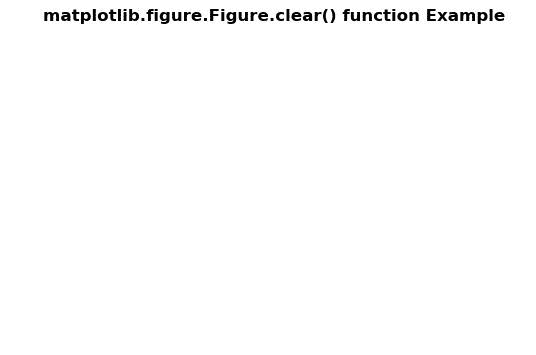

# Python 中的 Matplotlib.figure.Figure.clear()

> 原文:[https://www . geesforgeks . org/matplotlib-figure-figure-clear-in-python/](https://www.geeksforgeeks.org/matplotlib-figure-figure-clear-in-python/)

**[Matplotlib](https://www.geeksforgeeks.org/python-introduction-matplotlib/)** 是 Python 中的一个库，是 NumPy 库的数值-数学扩展。**人物模块**提供了顶级的艺术家，人物，包含了所有的剧情元素。该模块用于控制所有情节元素的子情节和顶层容器的默认间距。

## matplotlib.figure.Figure.clear()函数

**使用 matplotlib 库的 clear()方法**图形模块清除图形。

> **语法:**清除(self，keep _ observers = False)
> 
> **参数:**这接受下面描述的以下参数:
> 
> *   **keep _ observer:**该参数为布尔值。
> 
> **返回:**该方法不返回值。

下面的例子说明了 matplotlib.figure.Figure.clear()函数在 matplotlib.figure 中的作用:

**例 1:**

```py
# Implementation of matplotlib function
import numpy as np
import matplotlib.pyplot as plt

fig, ax = plt.subplots()

ax.set_xlabel('x-axis')
ax.set_ylabel('y-axis')

ax.plot([1, 2, 3])
ax.grid(True)

fig.clear(True)

fig.suptitle('matplotlib.figure.Figure.clear() \
function Example\n\n', fontweight ="bold")

plt.show()
```

**输出:**


**例 2:**

```py
# Implementation of matplotlib function
import numpy as np
import matplotlib.pyplot as plt

t = np.linspace(0.0, 2.0, 201)
s = np.sin(2 * np.pi * t)

fig, [ax, ax1] = plt.subplots(2, 1, 
                              sharex = True)

ax.set_ylabel('y-axis')
ax.plot(t, s)
ax.grid(True)
ax.set_title('Sample Example',
             fontsize = 12,
             fontweight ='bold')

ax1.set_ylabel('y-axis')
ax1.plot(t, s)
ax1.grid(True)

fig.clear(False)

fig.suptitle('matplotlib.figure.Figure.clear() \
function Example\n\n', fontweight ="bold")

plt.show()
```

**输出:**
