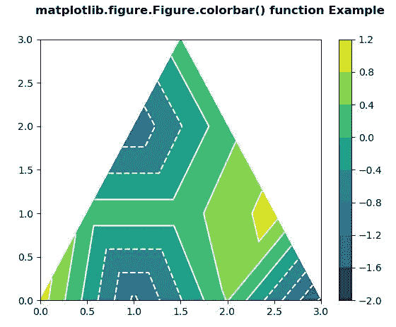
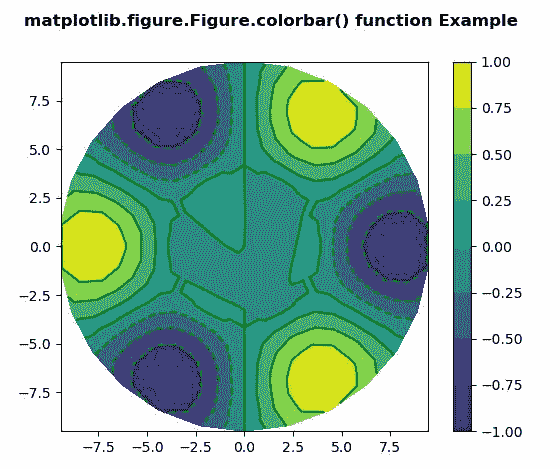

# matplot lib . figure . figure . colorbar()中的 Python

> 哎哎哎:# t0]https://www . geeksforgeeks . org/matplotlib-figure-colorbar-in-python/上

**[Matplotlib](https://www.geeksforgeeks.org/python-introduction-matplotlib/)** 是 Python 中的一个库，是 NumPy 库的数值-数学扩展。**人物模块**提供了顶级的艺术家，人物，包含了所有的剧情元素。该模块用于控制所有情节元素的子情节和顶层容器的默认间距。

## matplotlib . figure . figure . colorbar()函数

**matplotlib 库的图形模块的 colorbar()方法**用于给一个图添加一个 colorbar。

> **语法:** colorbar(self，可映射，cax=None，ax=None，use_gridspec=True，**kw)
> 
> **参数:**这接受下面描述的以下参数:
> 
> *   **可映射:**该参数对于 Figure.colorbar 方法是必需的。
> *   **cax :** 该参数是彩条将要绘制到的轴。
> *   **ax :** 此参数是父轴，新彩条轴的空间将从父轴中被窃取。
> *   **使用 _gridspec :** 此参数用于使用 gridspec 模块创建子图的实例。
> 
> **返回:**该方法不返回值。

下面的例子说明了 matplotlib.figure . figure . color bar()函数在 matplotlib . figure 中的作用:

**例 1:**

```py
# Implementation of matplotlib function
import matplotlib.pyplot as plt
import matplotlib.tri as mtri
import numpy as np

# Create triangulation.
x = np.asarray([0, 1, 2, 3, 0.5,
                1.5, 2.5, 1, 2, 
                1.5])

y = np.asarray([0, 0, 0, 0, 1.0,
                1.0, 1.0, 2, 2, 
                3.0])

triangles = [[0, 1, 4], [1, 5, 4], 
             [2, 6, 5], [4, 5, 7],
             [5, 6, 8], [5, 8, 7],
             [7, 8, 9], [1, 2, 5], 
             [2, 3, 6]]

triang = mtri.Triangulation(x, y, triangles)
z = np.cos(3 * x) * np.cos(6 * y)+np.sin(6 * x)

fig, axs = plt.subplots()
t = axs.tricontourf(triang, z)
axs.tricontour(triang, z, colors ='white')
fig.colorbar(t)

fig.suptitle('matplotlib.figure.Figure.colorbar() \
function Example\n\n', fontweight ="bold")

plt.show()
```

**输出:**


**例 2:**

```py
# Implementation of matplotlib function
import matplotlib.pyplot as plt
import matplotlib.tri as tri
import numpy as np

n_angles = 26
n_radii = 10
min_radius = 0.35
radii = np.linspace(min_radius,
                    0.95,
                    n_radii)

angles = np.linspace(0, 2 * np.pi,
                     n_angles,
                     endpoint = False)

angles = np.repeat(angles[..., np.newaxis], 
                   n_radii,
                   axis = 1)

angles[:, 1::2] += np.pi / n_angles

x = (10 * radii * np.cos(angles)).flatten()
y = (10 * radii * np.sin(angles)).flatten()
z = (np.cos(4 * radii) * np.cos(3 * angles)).flatten()

triang = tri.Triangulation(x, y)

triang.set_mask(np.hypot(x[triang.triangles].mean(axis = 1),
                         y[triang.triangles].mean(axis = 1))
                < min_radius)

fig1, ax1 = plt.subplots()
ax1.set_aspect('equal')
tcf = ax1.tricontourf(triang, z)
fig1.colorbar(tcf)
ax1.tricontour(triang, z, colors ='g')

fig1.suptitle('matplotlib.figure.Figure.colorbar()\
function Example\n\n', fontweight ="bold")

plt.show()
```

**输出:**
